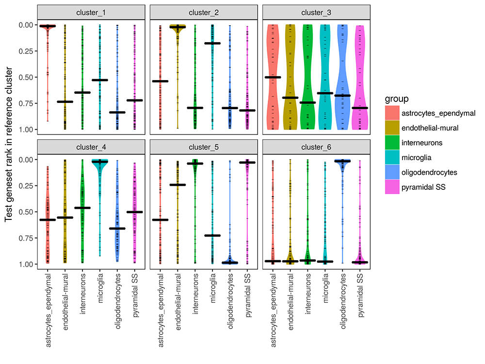

# celaref

### Function  

Single cell RNA sequencing (scRNAseq) has made it possible to examine the 
cellular heterogeny within a tissue or sample, and observe changes and 
characteristics in specific cell types. To do this, we need to group the cells
into clusters and figure out what they are.

The celaref package aims to streamline the cell-type identification step, by 
suggesting cluster labels on the basis of similarity to an already-characterised
reference dataset - wheather that's from a similar experiment performed 
previously in the same lab, or from a public dataset from a similar sample. 

### Input

To look for cluster similarities celaref needs:

* The query dataset :
    - a table of read counts per cell per gene
    - a list of which cells belong in which cluster
   
* A reference dataset:
    - a table of read counts per cell per gene
    - a list of which cells belong in which *annotated* cluster
   
### Output

 

### More information?

Full details in the vignette.

