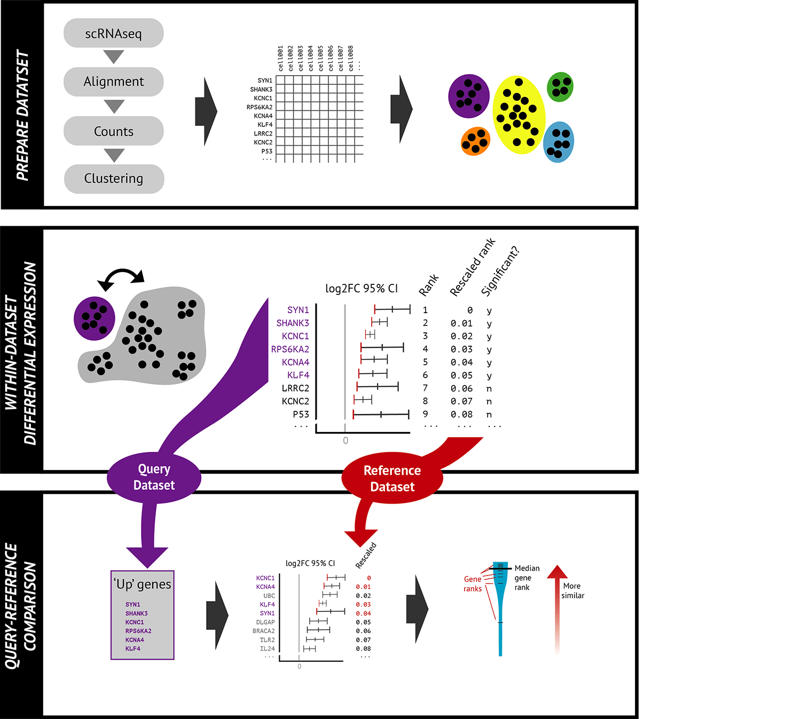
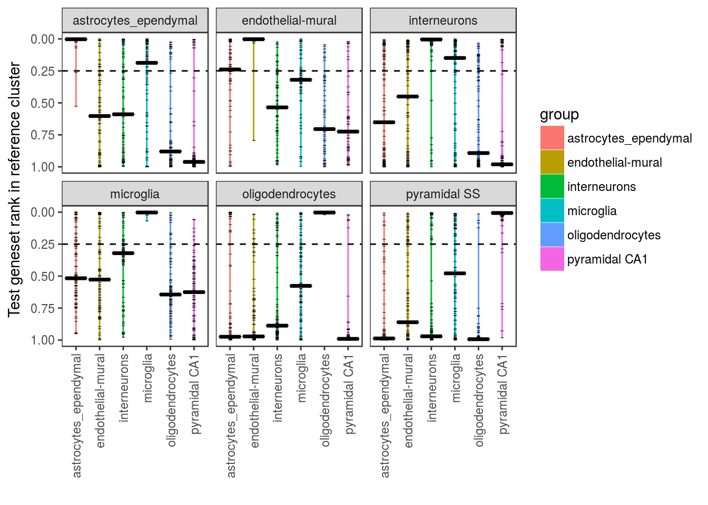
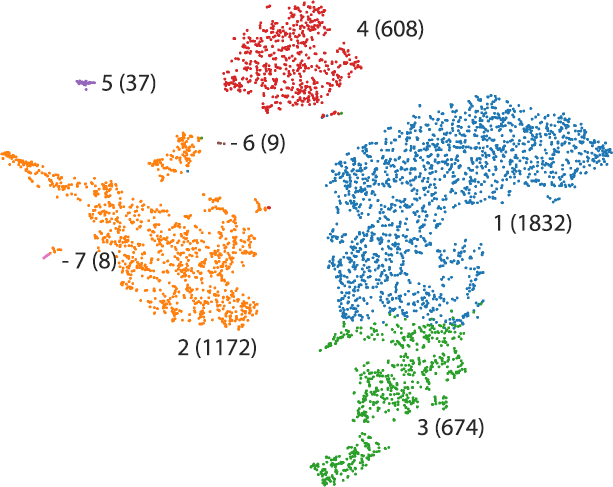

```{r setup, include = FALSE}
knitr::opts_chunk$set(
  collapse = TRUE,
  comment = "#>"
)
library(celaref)
library(knitr) #kable
library(ggplot2)
library(dplyr)
library(magrittr)
library(readr)
library(tibble)


```


# Overview {#overview}


Single cell RNA sequencing (scRNAseq) has made it possible to examine the 
cellular heterogeneity within a tissue or sample, and observe changes and 
characteristics in specific cell types. To do this, we need to group the cells
into clusters and figure out what they are.

In a typical scRNAseq experiment the 
gene expression levels are first quantified to per-cell counts. 
Then, cells are clustered into related groups 
(or clusters) on the basis of transcriptional similarity. There are many 
different cell-clustering tools that can do this [@Freytag2017]. 

Clustering tools generally define groups of similar cells - but do not 
offer explanation as to their biological contents. The annotation of the 
'cell type' of each cluster is performed by a domain expert biologist - who 
can examine the known marker genes, or differential expression to understand 
what type of cell each cluster might describe. This can be a time-consuming 
semi-manual process, and must be performed before addressing the actual biological 
question of interest. 


The celaref package aims to streamline this cell-type identification step, by 
suggesting cluster labels on the basis of similarity to an already-characterised
reference dataset - whether that's from a similar experiment performed 
previously in the same lab, or from a public dataset from a similar sample. 


Celaref differs from other cell-type identification tools like scmap 
[@Kiselev2018] or (functions in) [MUDAN](https://github.com/JEFworks/MUDAN) in that it operates at the cluster-level.


Celaref requires a table of read counts per cell per gene, and a list of the cells 
belonging to each of the clusters, (for both test and reference data). 
It compares the reference sample rankings of the most distinctly enriched genes 
in each query group to match cell types.


## Workflow {#workflow}


A typical celaref workflow is below, characterising a query dataset’s cell clusters on the basis of transcriptomic similarity to a annotated reference dataset.




### Prepare dataset

To compare scRNAseq datasets with celaref, two inputs are needed for each dataset:

1. A counts matrix of number of reads per gene, per cell.

gene  | Cell1 | cell2 | cell3 | cell4 |  ...  | cell954
------|-------|-------|-------|-------|-------|--------|
GeneA |     0 |     1 |     0 |    1  |  ...  |    0
GeneB |     0 |     3 |     0 |    2  |  ...  |    2
GeneC |     1 |    40 |     1 |    0  |  ...  |    0

2. Cluster assignment for each cell. 

CellId  | Cluster
--------|---------
cell1   | cluster1 
cell2   | cluster7
 ...    | ...    
cell954 | cluster8

See [Input](#input) for details.

Cell clusters might be defined by any cell-clustering technique, such as those implemented in tools such as Seurat [@Satija2015], cellRanger (10X genomics), SC3[@Kiselev2017], among many others.

### Within dataset differential expression

Every dataset, whether a query or a reference, is prepared the same way. For each cluster, cells within that cluster are compared to the rest of the cells pooled together, calculating differential gene expression using MAST [@Finak2015]. Because of the low counts and potential drop-out issues in single cell RNAseq data, only genes enriched in each cluster are considered. For every cluster – cells are ranked from most to least enriched according to their lower 95% CI of fold-change. Each gene is assigned a ‘rescaled rank’ from 0 (most enriched) to 1 (most absent). 

That this step is the most time consuming, but only needs to be done once per dataset.

### Query-Reference comparison

A list of ‘Up’ genes are extracted for each query cluster – defined as those that have significantly higher expression in that cluster versus the rest of the sample (p<0.01 after BH multiple hypothesis correction). The ‘Up’ gene list is capped at the top 100 (ranked by lower 95% FC). Then, those genes are looked up in the ranking of genes in each reference cell cluster.  The distribution of these ‘up gene’ ranks is plotted to evaluate similarity of the query cell-group to a reference cell-group. 


Output plots are described [here](#output).

## Output{#output}

### Interpreting output {#interpreting-output}

Typically, every cell cluster in the query data (each box) is plotted against everything in the reference data (X-axis). Each of the ‘up’ genes is represented by a tick mark, and the median generank is shown as a thick bar. A biased distribution near the top (i.e.. rescaled rank of 0) indicates similarity of the groups – essentially the same genes are representative of the clusters within their respective samples. 



* A median gene rank of 0.5 would indicate a completely random distribution. However, much lower values are common. 
The reciprocal nature of the within-dataset differential expression can cause this - what's up in 
one cluster is down in another.


* A small or heterogeneous cell group will not have much statistical power to select many 'top' genes
(few tick marks) and these distributions will not be particuarly informative.
If there are no 'top' genes it won't be plotted at all. 

* Because 'top' genes are compared to total reference rankings - the comparison 
between two datasets is not symmetrical. In ambiguous cases, it might helpful 
to plot the reverse comparison from reference to query. Note that these receiprocal 
comparisons are considered in [Assigning labels to clusters](#assigning-labels-to-clusters).
For instance - if a query cluster happens to be a mix of two reference cell groups,
a reciprocal plot may make this more obvious. 


### Assigning labels to clusters {#assigning-labels-to-clusters}

Lastly, there is a function to suggest some semi-sensible query cluster labels. 

The first 4 columns of output (below) are the most interesting, the rest are described at 
bottom of section. The suggested cluster label is in the **shortlab** column.
e.g.


test_group  | shortlab                        | pval    | stepped_pvals  
------------|------------------------------------|---------|---------------------
cluster_1   |cluster_1:astrocytes_ependymal      |2.98e-23 | astrocytes_ependymal:2.98e-23,microglia:0.208,interneurons:0.1,pyramidal SS:0.455,endothelial-mural:0.0444,oligodendrocytes:NA   
cluster_2   |cluster_2:endothelial-mural         |8.44e-10 | endothelial-mural:8.44e-10,microglia:2.37e-06,astrocytes_ependymal:0.000818,interneurons:0.435,oligodendrocytes:0.245,pyramidal SS:NA
cluster_3   |cluster_3:no_similarity             | NA      | astrocytes_ependymal:0.41,microglia:0.634,oligodendrocytes:0.305,endothelial-mural:0.512,interneurons:0.204,pyramidal SS:NA 
cluster_4   |cluster_4:microglia                 |2.71e-19 | microglia:2.71e-19,interneurons:0.435,pyramidal SS:0.11,endothelial-mural:0.221,astrocytes_ependymal:0.627,oligodendrocytes:NA 
cluster_5   |cluster_5:pyramidal SS\|interneurons|3.49e-10 | pyramidal SS:0.362,interneurons:3.49e-10,endothelial-mural:0.09,astrocytes_ependymal:0.0449,microglia:7.68e-19,oligodendrocytes:NA 
cluster_6   |cluster_6:oligodendrocytes          |2.15e-28 | oligodendrocytes:2.15e-28,interneurons:0.624,astrocytes_ependymal:0.207,endothelial-mural:0.755,microglia:0.0432,pyramidal SS:NA


There can be none, one or multiple reference group similarities for the query group. 
This is expected when there are similar cell sub-populations in the reference data.
This can be visualised throught the relative shapes of the top gene distribution 
for the reference group, and reference group similarity labels are calculated as follows:

These labels are based on the distributions of the ranks of the query cluster's 'top' genes 
in each of the reference groups (as plotted in the [violin plots](#interpreting-output)), 
rescaled to be in the 0-1 range.

1. The median gene rank for the 'top' genes in each reference group is calculated.

2. Reference groups are ordered from most to least similar (ascending median rank).

3. Mann-Whitney U tests are calculated between the adjacent reference groups - 
ie. 1st-2nd most similar, 2nd-3rd, 3rd-4th e.t.c. 
These are the **stepped_pvals** reported above - the last value will always be undefined NA.
Essentially this is testing if the 'top' genes representative of the query group are
significantly lower ranked (more similar) in one reference group vs the next 
most similar reference group. A genuine similarity of cell types should result in 
an abrupt change in these gene rank distributions. 


4. Initial calls are made on which reference groups to include in the group label.
     - (a) If there is a significant difference (p < 0.01)  between the first and second most similar groups - report on the top ranked reference group. 
     The **pval** in this case will be the first stepped pvalue (which is significant).
     - (b) If there are no significant differences between any steps, report a lack of similarity.
     No p-value (NA) is reported - because no call could be made on what group(s) are more similar.
     Check the stepped_pvals to look at borderline cases. 
     - (c) Otherwise, start at the most similar reference group, and report everything up to the 
     first signifcantly different ranking. Effectively, this reports multiple 
     reference group similarities when a call can't be made between them 
     e.g. subtypes, or a mixed query group. 
     Here the reported **pval** describes the 'jump' between the bottom ranked
     similar reference group, and the first of the other groups. e.g. the 2nd or
     3rd stepped pvalue.


5. The group assignment from step 4 is checked to ensure that the (median of the) gene ranks 
is significantly above a random distribution. Ie. above the 0.5 halfway point in the 
violin plots.
     - The distribution of the 'top' genes in the matched group (or last-ranked 
     matching group when there are multiple matches) is tested to 
     see if its median rank is significantly above 0.5 (sign test, using one-tailed
     binomial test on ranks < 0.5).  If this fails (<0.01), 'No_similarity' 
     will be reported, even if the p-value is significant. See Group1 and Group2 results
     in the quickstart example (occurs due to being only a 200 gene test).
     *B: This means that a significant 'pval' column can sometime occur on a 
     'No_similarity' label - but the pval_vs_random column (described below) 
     will be non-significant.
     - This test exists for cases of significant difference from an 
     'anti-some-other-celltype' signature with genes distributed at the low end.
     That can occur when there are uneven gene cluster sizes and no 
     genuine match for the query.


6. Reciprocal-only matches are added to cluster labels in brackets. 
     - e.g. c1:celltypeA(celltypeB) or c2:(celltypeC)
     - The cluster groups are reciprocally tested against the query groups. 
     All reciprocal matches are listed in the *reciprocal_matches* column.
     If there is a recriprocal match that isn't in the query->ref match list, its
     added on to the end of the cluster label. 
     - Reciprocal matches reported in the cluster names might indicate a mixed 
     query cell type. It woudl be a good idea to look at the reciprocalviolin plot of 
     the reference dataset vs the query.
     


---------

The full version of this table is:


test_group  | shortlab                        | pval    | stepped_pvals | pval_to_random | matches | reciprocal_matches | similar_non_match| similar_non_match_detail| differences_within 
------------|---------------------------------|---------|---------------|----------------|---------|--------------------|------------------|-------|-----
astrocytes|astrocytes:astrocytes_ependymal|2.98e-23|astrocytes_ependymal:2.98e-23,microglia:0.208,interneurons:0.1,pyramidal SS:0.455,endothelial-mural:0.0444,oligodendrocytes:NA|1.00e-21|astrocytes_ependymal|astrocytes_ependymal|||
endothelial|endothelial:endothelial-mural|8.44e-10|endothelial-mural:8.44e-10,microglia:2.37e-06,astrocytes_ependymal:0.000818,interneurons:0.435,oligodendrocytes:0.245,pyramidal SS:NA|3.55e-21|endothelial-mural|endothelial-mural|||
hybrid|hybrid:No similarity||astrocytes_ependymal:0.41,microglia:0.634,oligodendrocytes:0.305,endothelial-mural:0.512,interneurons:0.204,pyramidal SS:NA||||||
microglia|microglia:microglia|2.71e-19|microglia:2.71e-19,interneurons:0.435,pyramidal SS:0.11,endothelial-mural:0.221,astrocytes_ependymal:0.627,oligodendrocytes:NA|3.54e-16|microglia|microglia|||
neurons|neurons:pyramidal SS\|interneurons|3.49e-10|pyramidal SS:0.362,interneurons:3.49e-10,endothelial-mural:0.09,astrocytes_ependymal:0.0449,microglia:7.68e-19,oligodendrocytes:NA|2.19e-12|pyramidal SS\|interneurons|interneurons\|pyramidal SS|||
oligodendrocytes|oligodendrocytes:oligodendrocytes|2.15e-28|oligodendrocytes:2.15e-28,interneurons:0.624,astrocytes_ependymal:0.207,endothelial-mural:0.755,microglia:0.0432,pyramidal SS:NA|4.72e-20|oligodendrocytes|oligodendrocytes|||


The next few columns of the ouput describe some of the heuristics used in the cluster labelling.

* **pval_to_random** : P-value of test of median rank (of last matched reference group) < random, from binomial test on top gene ranks (<0.5). 
If this isn't signiicant, 'No similarity' will be reported. A completely random distribution would have a median rank in the middle of the 
violin plots, at 0.5.

* **matches** : List of all reference groups that 'match', as described, except it also includes (rare) examples where pval_to_random is not significant. "|" separated, in descending order of match. 

* **reciprocal_matches** : List of all reference groups that flagged test group as a match when directon of comparison is reversed. (significant pval and pval_to_random).  "|" separated, in descending order of match. 


------------------


The last 3 columns of the output are usually empty. 
When defined they may indicate borderline labelling or edge cases - checking the 
violin plots is advised! Tests are again Mann-Whitney U, but on non-adjacently ranked groups.

* **similar_non_match** : This column lists any reference groups outside of the 
reported label match that are not signifcantly different to a reported match group. 
E.g If a query matches group A (because A is significantly different to the 
second-ranked B); if A is then not significantly different to the third -ranked C, then C will be reported here. 
This is more likely with smaller sets of 'top genes', for instance in Group3 of the quickstart example. 
Examples:
    * NA [Nothing]
    * C
    * microglia|interneurons

* **similar_non_match_detail**: P-values for any details about similar_non_match results. 
These p-values will always be non-significant (but again may be borderline).
Examples:
    * NA [Nothing]
    * A > C (p=0.0214,n.s)
    * dunno > Exciting (p=0.0104,n.s)

* **differences_within**: This feild lists any pairs of matched groups (in
shortlab) that are significantly different. This could happen if there are many 
matched groups listed in shortlab, that are all slightly different. Examples
    * NA [Nothing]
    * B > E (p=0.004)|C > E (p=0.009)


# Using the package

## Installation


The bioconductor landing page with information about this package is at 
https://bioconductor.org/packages/celaref
 
To install from bioconductor via BiocManager
```{r eval=FALSE}
# Installing BiocManager if necessary:
# install.packages("BiocManager")
BiocManager::install("celaref")
```

Or, to use the dev version from github
```{r eval=FALSE}
devtools::install_github("MonashBioinformaticsPlatform/celaref")
# Or
BiocManager::install("MonashBioinformaticsPlatform/celaref")
```

## Quickstart

Suppose there's a new scRNAseq dataset (the query), whose cells have already 
been clustered into 4 groups : Groups 1-4. But we don't know which 
group corresponds to which cell type yet.

Luckily, there's an older dataset (the reference) of the same tissue type in which 
someone else has already determined the cell types. 
They very helpfully named them  'Weird subtype', 'Exciting', 'Mystery cell type' and 'Dunno'.

This example uses the reference dataset to flag likely cell types in the new experiment.

It is a tiny simulated dataset (using splatter [@Zappia2017]) of 200 genes included in the package that can be copy-pasted, and will complete fairly quickly.


```{r toy_example, message=FALSE, eval=TRUE}

library(celaref)

# Paths to data files.
counts_filepath.query    <- system.file("extdata", "sim_query_counts.tab",    package = "celaref")
cell_info_filepath.query <- system.file("extdata", "sim_query_cell_info.tab", package = "celaref")
counts_filepath.ref      <- system.file("extdata", "sim_ref_counts.tab",      package = "celaref")
cell_info_filepath.ref   <- system.file("extdata", "sim_ref_cell_info.tab",   package = "celaref")

# Load data
toy_ref_se   <- load_se_from_files(counts_file=counts_filepath.ref, cell_info_file=cell_info_filepath.ref)
toy_query_se <- load_se_from_files(counts_file=counts_filepath.query, cell_info_file=cell_info_filepath.query)

# Filter data
toy_ref_se     <- trim_small_groups_and_low_expression_genes(toy_ref_se)
toy_query_se   <- trim_small_groups_and_low_expression_genes(toy_query_se)

# Setup within-experiment differential expression
de_table.toy_ref   <- contrast_each_group_to_the_rest(toy_ref_se,    dataset_name="ref")
de_table.toy_query <- contrast_each_group_to_the_rest(toy_query_se,  dataset_name="query")
```

```{r toy_example1b, message=FALSE, eval=TRUE}
# Plot
make_ranking_violin_plot(de_table.test=de_table.toy_query, de_table.ref=de_table.toy_ref)
```

```{r toy_example2, message=FALSE, warnings=FALSE, eval=FALSE} 
# And get group labels
make_ref_similarity_names(de_table.toy_query, de_table.toy_ref)
```

```{r toy_example3,  echo=FALSE, message=FALSE, warnings=FALSE, }
kable(make_ref_similarity_names(de_table.toy_query, de_table.toy_ref), digits=50)
```

NB: Groups1 and Group2 are not labelled due to the non-significant 
'pval_to_random' (see section [Assigning labels to clusters](#assigning-labels-to-clusters) ). 
This happens here because its a small 200-gene toy dataset!


## Prepare data {#input}

The celaref package works with datasets in 'SummarizedExperiment' objects. 
While they can be constructed manually there are several functions (below) to 
create them in a format with all the required information.

The following pieces of information are needed to use a single cell RNAseq 
dataset with celaref.

1. **Counts Matrix** Number of gene tags per gene per cell.
2. **Cell information** A sample-sheet table of cell-level information. Only two 
   fields are essential:
    * *cell_sample*: A unique cell identifier 
    * _group_: The cluster/group to which the cell has been assigned. 
3. **Gene information** Optional. A table of extra gene-level information.
    * *ID*: A unique gene identifier 

The cell information tables can contain whatever experimentally relevant data 
is desired, like treatment, batches, individual e.t.c

The celaref package doesn't do any clustering itself - cells should have 
already been assigned to cluster groups on the basis of transcriptional 
similarity using one of the many single-cell clustering tools available (For a evaluation of some clustering tools: [@Freytag2017]). Note 
that any cells not assigned to a group will not be processed.

For a querying dataset clusters will of course have arbitrary names like 
c1,c2,c3 e.t.c but for reference datasets they should be something meaningful
(e.g. 'macrophages'). 

Providing gene-level information is entirely optional, because it can be taken 
from the counts matrix. It is useful for tracking multiple IDs, see [Converting IDs](#converting-ids)

### Input data {#input-data}

#### From tables or flat files {#from-tables-or-flat-files}

The simplest way to load data is with two files. 

1. A tab-delimited counts matrix:

gene  | Cell1 | cell2 | cell3 | cell4 |  ...  | cell954
------|-------|-------|-------|-------|-------|--------|
GeneA |     0 |     1 |     0 |    1  |  ...  |    0
GeneB |     0 |     3 |     0 |    2  |  ...  |    2
GeneC |     1 |    40 |     1 |    0  |  ...  |    0

2. And a tab-delimited cell info / sample-sheet file of cell-level information, including the 
group assignment for each cell ('Cluster'), and any other useful information.

CellId  | Sample  |  Cluster
--------|---------|---------
cell1   | Control | cluster1 
cell2   | Control | cluster7
 ...    | ...     | ...
cell954 | KO      | cluster8

This example dataset would be loaded with *load_se_from_files*:

```{r eval=FALSE}
dataset_se <- load_se_from_files(counts_matrix   = "counts_matrix_file.tab", 
                                  cell_info_file = "cell_info_file.tab", 
                                  group_col_name = "Cluster")
```


Note the specification of the 'Cluster' column as the *group_col_name*. 
Internally, (and throughout this doco), there are references to the 
'cell_sample' and 'group' columns. 
They can use these exact names in the input tables, or be assumed or 
specified when loaded.

The following command does exactly the same thing, but explicitly specifies the cell 
identifier as 'CellId'. If *cell_col_name* is omitted, it is assumed to be
the first column of the cell info table.

```{r eval=FALSE}
dataset_se <- load_se_from_files(counts_matrix   = "counts_matrix_file.tab", 
                                  cell_info_file = "cell_info_file.tab",
                                  group_col_name  = "Cluster",
                                  cell_col_name   = "CellId" )
```
If cell information is missing (from cell info or from the counts),
the cell will just be dropped from the analysis. 
This is useful when excluding cells or subsetting the analysis - it is enough to
remove entries from the cell info table before loading.
When this happens a warning message displays the number of cells kept.

-----

Optionally, a third file, with gene-level information might be included.

Gene   | NiceName
-------|-----------       
GeneA  | NiceNameA
GeneB  | NiceNameB
GeneC  | NiceNameC

```{r eval=FALSE}
dataset_se <- load_se_from_files(counts_matrix   = "counts_matrix_file.tab", 
                                  cell_info_file = "cell_info_file.tab", 
                                  gene_info_file = "gene_info_file.tab",
                                  group_col_name = "Cluster")

```

If extra gene information is provided, the first column (or a column named 'ID') 
must be unique. Every gene in the counts matrix must have an entry in the 
gene info table, and vice versa.


-----

Alternatively, if the data is already loaded into R, the *load_se_from_tables* function
will accept data frames instead of filenames. The *load_se_from_files* function 
is just a wrapper for *load_se_from_tables*.

```{r eval=FALSE}
dataset_se <- load_se_from_tables(counts_matrix   = counts_matrix, 
                                  cell_info_table = cell_info_table, 
                                  group_col_name  = "Cluster")
```


#### From 10X pipeline output


The 10X cellRanger pipelines produce a directory of output including the counts 
matrix files and several different clusters. This kind of output directory 
will contain sub-directories called 'analysis', 'filtered_gene_bc_matrices'

To read in a human (GRCh38) dataset using the 'kmeans_7_clusters' clustering:

```{r eval=FALSE}
dataset_se <- load_dataset_10Xdata('~/path/to/data/10X_mydata', 
                                   dataset_genome = "GRCh38", 
                                   clustering_set = "kmeans_7_clusters") 

```

Note that the cell ranger pipelines seem to produce many different cluster sets, 
their names should be seen in the cell loupe browser, or listed in 
the 10X_mydata/analysis/clustering directory.


NB: This function is quite basic and assumes the file at 10X_mydata/filtered_gene_bc_matrices/GRCh38/genes.csv
will have columns `<ensemblID><GeneSymbol>`. See function doco if this is not the case. 
For more involved cases, the [cellrangerRkit](https://support.10xgenomics.com/single-cell-gene-expression/software/pipelines/latest/rkit)
package may be necessary.


#### Directly with SummarizedExperiment objects

The data loading functions here are just convenient ways of making the SummarizedExperiment 
objects with the content that celaref functions expect, handling naming and 
checking uniqueness e.t.c. 
See [SummarizedExperiment doco](https://bioconductor.org/packages/release/bioc/html/SummarizedExperiment.html)

The minimum mandatory fields are described in section [Input data](#input-data), specifically:

* Within colData(dataset_se): **cell_sample** and **group** columns.
* Within rowData(dataset_se): **ID** column.

Note that **group** needs to be a factor, but **cell_sample** and **ID** 
should _not_ be factors.

The colData (cell information) and rowData (gene information) should exactly 
match the columns and rows of the counts matrix. 

The counts matrix should be a matrix of integer counts. If there are multiple
assays present, the counts should be the first. Sparse matricies are 
ok, but hdf5-backed delayedArray matricies are not yet supported 
(as produced by save/loadHDF5SummarizedExperiment functions
from HDF5Array package). 
See section [Handling large datasets](#handling-large-datasets) for 
alternatives.

#### Handling large datasets {#handling-large-datasets}

Many (if not most) single cell datasets are too large to comforatably 
process using a basic dense matrix. (The default if using *load_se_from_files*)

To process large datasets:

1. Supply a hdf5-backed delayedArray SummarizedExperiment object
   (via the save/loadHDF5SummarizedExperiment functions from HDF5Array package)
   Or, store the counts in a sparse Matrix (via capital M Matrix package), and
   use function *load_se_from_tables*.


```{r eval=FALSE}
library(Matrix) 
#a sparse big M Matrix.
dataset_se.1 <- load_se_from_tables(counts_matrix = my_sparse_Matrix,
                                  cell_info_table = cell_info_table, 
                                  group_col_name  = "Cluster")

# A hdf5-backed SummarisedExperiment from elsewhere
dataset_se.2 <- loadHDF5SummarizedExperiment("a_SE_dir/")

```
   Note however that this will evenutally be converted to a sparse matrix 
   internally in the differential expression calculations - so large dataset 
   might need subsetting (below...)
   

2. Use the n.group and n.others options in *contrast_each_group_to_the_rest*
   to subset the dataset in each contrast. This will keep
   all of the 'test' group cells, and subsample the rest individually for each 
   group's differential expression calculations. Doing this separetly for
   each comparisons will maitain the relative proportions of cell types, which
   might be useful in cross-experiment comparisons.

```{r}
# For consistant subsampling, use set.seed
set.seed(12)
de_table.demo_query.subset <- 
   contrast_each_group_to_the_rest(demo_query_se, "subsetted_example",
                                   n.group = 100, n.other = 200)
```


3. For very large datasets, it might be better to shrink the dataset upfront
   (losing the proportionality of cell types).
   The *subset_cells_by_group* function will do this - here keeping 100 
   (or all) cell per group.

```{r}
set.seed(12)
demo_query_se.subset <- subset_cells_by_group(demo_query_se, n.group = 100)
```


#### Reading microarray data {#reading-microarray-data}

Microarray datasets of purified cell-types can be used as references too. 
However, the analysis doesn't use summarizedExperiment objects the same way, so 
it does the within-experiment differential expression directly.

Refer to section [Prepare data with within-experiment differential expression](#prepare-data-with-within-experiment-differential-expression) for details.

The [Limma](http://bioconductor.org/packages/release/bioc/html/limma.html) package
needs to be installed to use this function. 
Limma is used to calculate the differential 
expression on the microarrays, rather than MAST which is used for the single-cell
RNAseq data.

```{r eval=FALSE}
de_table.microarray <- contrast_each_group_to_the_rest_for_norm_ma_with_limma(
    norm_expression_table=demo_microarray_expr, 
    sample_sheet_table=demo_microarray_sample_sheet,
    dataset_name="DemoSimMicroarrayRef", 
    sample_name="cell_sample", group_name="group") 

```


### Input filtering and Pre-processing

#### Filtering cells and low-expression genes {#filtering}

It is standard practice to remove uninformative low-expression genes before
calculating differential expression. And in single-cell sequencing, low counts 
can indicate a problem cell - which can be dropped. 
Similarly, for the celaref package, very small cell groups will not have the 
statistical power to detect similarity.

The *trim_small_groups_and_low_expression_genes* function will remove cells and 
genes that don't meet such thresholds. Defaults are fairly inclusive, and will 
require tweaking according to different experiments or technologies.

It can be helpful to check the number of genes and cells surviving 
*trim_small_groups_and_low_expression_genes* filtering with *dim(dataset_se)*, 
and the number of cells per group with *table(dataset_se$group)*.

```{r eval=TRUE, echo=FALSE}
# Just define a dummy dataset_se from less generically named test data,
# so it can be run during vignette compilation.
dataset_se <- toy_query_se
```


```{r eval=TRUE}
# Default filtering
dataset_se <- trim_small_groups_and_low_expression_genes(dataset_se)

# Also defaults, but specified
dataset_se <- trim_small_groups_and_low_expression_genes(dataset_se, 
                                    min_lib_size = 1000, 
                                    min_group_membership = 5,  
                                    min_detected_by_min_samples = 5)

```
Refer to function doco for exact definitions of these parameters.


#### Converting IDs {#converting-ids}

Converting one type of gene identifier to another gene identifier is annoying. 
Even with major identifiers like ensembl IDs (ENSG00000139618) or gene symbols
(SYN1) there will be imperfect matching (missing ids, multiple matches).

If multiple gene IDs were provided when creating the summarizedExperiment 
object, (i.e. a gene info table/file), a convenience function 
*convert_se_gene_ids* will allow a graceful conversion between them. 

The function needs a tie-breaker for many-to-one gene relationships though - picking
the one with higher read counts is a decent choice. Note that if both match, 
the choice is essentially arbitrary (consistency is not guaranteed).

The following code will convert from the original gene IDs (e.g.if ID is 
ensemblID), to 'GeneSymbol' (which should be a column name in rowData(dataset_se))

It will:

 * Define a genotype data level column *total_count* with summed read counts per gene to use as the *eval_col*.
 * Remove any genes that have no GeneSymbol associated with the ensembl ID
 * If the same GeneSymbol is assigned to multiple ensembl IDs - it looks up the 
   *eval_col* value and picks the bigger one.

```{r eval=FALSE} 
# Count and store total reads/gene.
rowData(dataset_se)$total_count <- Matrix::rowSums(assay(dataset_se))
# rowData(dataset_se) must already list column 'GeneSymbol'
dataset_se <- convert_se_gene_ids(dataset_se, new_id='GeneSymbol', eval_col = 'total_count')

```

It can be helpful to check the number of genes before and after 
*convert_se_gene_ids* with *dim(dataset_se)*. 


### Within-experiment differential expression {#prepare-data-with-within-experiment-differential-expression}

Once data is loaded into summarizedExperiment objects, the groups in each 
dataset need to be analysed within-dataset before any cross-dataset comparisons 
can be done. This is the most time consuming step, but only needs to be done once per dataset.

Essentially, we want to rank all genes from most to least 'distinctive' for each group in the dataset. 

Differential expression is calculated for every group 
versus the rest of the dataset pooled together using MAST[@Finak2015]. 
This will provide relative 
expression for everything relative to the rest of the tissue or sample as 
background.An independent experiment will have its own biases, but with any luck the same 
genes should be 'distinctive' for the same cell type regardless. 
Since single cell RNAseq data can have many zeros and drop outs, celaref 
focuses on overrepresented genes. Genes are ranked from most to least
overrepresented on the basis of their most conservative ('inner') 95% confidence 
interval of log2FC. This rank is a simple compromise between expected size-of-effect 
(log2FC - which can change over-dramatically for low-expression genes), and 
statistical power (from a p-value ranking).

This is done with the *contrast_each_group_to_the_rest* function 
after [filtering](#filtering):

```{r eval=TRUE}
demo_query_se.filtered <- trim_small_groups_and_low_expression_genes(demo_query_se)

de_table.demo_query <- contrast_each_group_to_the_rest(demo_query_se.filtered, "a_demo_query")
```

Reference datasets are prepared with the same command, there's no difference in the result.
```{r eval=TRUE}
demo_ref_se.filtered <- trim_small_groups_and_low_expression_genes(demo_ref_se)
de_table.demo_ref   <- contrast_each_group_to_the_rest(demo_ref_se.filtered,   "a_demo_reference")
```

This object can be now passed to subsequent comparison functions - see section [Compare groups to reference](#Making-comparisons-to-reference-data). 

-----

For clarity, the results objects have names starting with de_table, but they are simply
tibble (data.frame-like) objects that look like this:
```{r eval=TRUE, echo=FALSE}
kable(head(de_table.demo_query))
```

As for what it contains, the important fields are:

 * __ID__       : Gene ID
 * __fdr__      : The multiple hypothesis corrected p-value (BH method)
 * __log2FC__   : Log2 fold-change of for this gene's expression in the (test group) - (rest of sample)
 * __ci_inner__ : The inner (most conservative/nearest 0) 95% confidence interval of __log2FC__. This is used to rank genes from most-to-least overrepresented in this group, with respect to the rest of the sample.
 * __group__    : Group being tested (all are tested by default)
 * __sig_up__   : Is this gene significantly (__fdr__ <=0.01) enriched (__log2FC__ > 0) in this group.
 * __rank__     : Numerical rank of __ci_inner__ from most (1) to least (n).
 * __rescaled_rank__ : Rank rescaled from most (0) to least (1) - used in analyses and plotting.
 * __dataset__  : Name of this dataset

-----

This function is parallelised. Due to the differential expression calculations, this is a 
time-consuming step (e.g. a few hours, depending on data size). 
But the result can and should be saved and reused for any comparisons to other datasets. 
If *num_cores* is specified, up to that many groups will be processed in 
parallel. This is highly recommended. For best 
results *num_cores* should be set to the number of groups in the query so long
as system resources permit.

-----

Microarray reference data is treated differently, with function _contrast_each_group_to_the_rest_for_norm_ma_with_limma()_ that both loads data
and does within sample differential expression in one step. Its output is much the same. See 
[section on microarray input](#reading-microarray-data) for details.
```{r eval=TRUE}
de_table.microarray <- contrast_each_group_to_the_rest_for_norm_ma_with_limma(
    norm_expression_table=demo_microarray_expr, 
    sample_sheet_table=demo_microarray_sample_sheet,
    dataset_name="DemoSimMicroarrayRef", 
    sample_name="cell_sample", group_name="group") 
```


## Running comparisions {#Making-comparisons-to-reference-data}

### Compare groups to reference

Once the dataset has been compared to itself (see [Prepare data with within-experiment differential expression](#prepare-data-with-within-experiment-differential-expression)), the 
groups can be compared to the reference dataset.


The main output of celaref are the violin plots of the reference group rankings of query group 
'top' genes. Each query group gets its own panel, with a violin plot of 
its 'top' gene rankings in each reference group. 
See section [Interpreting output](#interpreting-output) and the [overview diagram](#overview) full description of these plots. 


To make that output, run function *make_ranking_violin_plot*. 
(Note that _de_table.test_ and _de_table.ref_ parameters must be specified by name, not position.)
```{r eval=TRUE}
make_ranking_violin_plot(de_table.test=de_table.demo_query, de_table.ref=de_table.demo_ref)
```


To pull together the data for this plot the *get_the_up_genes_for_all_possible_groups* 
function is called internally. It can also be called by hand, see 
[Special case: Saving get_the_up_genes_for_all_possible_groups output](#Special-case:-Saving-get_the_up_genes_for_all_possible_groups-output).


That *get_the_up_genes_for_all_possible_groups* function will do two things

1. Identify 'top' genes for each group in the query dataset. i.e what is most 
distinctively high for this cell-type/group in the context of this 
tissue/sample. This is defined 
as up to the __first 100 genes with an inner log2FC 95% confidence interval >=1__. 
2. Lookup the rescaled rankings (again from most to least log2FC inner 95% CI) 
of 'top' genes in each reference group. 

NB: There is scope for the ranking criteria to be changed, but currently only 
the inner log2FC 95% confidence interval is implemented. Future work: Use of 'topconfects' 
is planned [@Harrison2018].


### Compare groups within a single dataset{#compare-groups-within-a-single-dataset}

Its often useful to compare a dataset to itself. Just specify the same dataset 
for *de_table.test* and *de_table.ref*. This will show how similar the groups are.
Clusters that can't be distinguished from each other might be a sign that too
many clusters were defined. 

```{r eval=TRUE} 
make_ranking_violin_plot(de_table.test=de_table.demo_query, de_table.ref=de_table.demo_query)
```


### Make labels for groups

Lastly, celaref can parse these comparisons and suggest group names for the 
query groups. 

The method for labelling used is described in section
[Assigning labels to clusters](#assigning-labels-to-clusters). The name in 
'shortlab' might make a good starting point for downstream characterisation.
These labels should generally be interperented alongside the violin plots.

```{r eval=TRUE} 
group_names_table <- make_ref_similarity_names(de_table.demo_query, de_table.demo_ref)
```
```{r eval=TRUE, echo=FALSE} 
kable(group_names_table)
```

Its unusual to have anything other than NA in the 'similar_non_match' column.
Explained in section 
[Assigning labels to clusters](#assigning-labels-to-clusters). 


--------------------------------

A note on the 'num_steps' parameter.

Function *make_ref_similarity_names* accepts an optional parameter 'num_steps'.
It doesn't affect the construction of the suggested labels in 'shortlab', only the 
extra 'similar_non_match' columns. Only pairs of reference groups *num_steps*  
away from each other when ranked by median generank are tested for difference - 
the nearer they are the more likely they're similar. 

It if is set too small though (e.g. 1), similar non-matched groups might be missed. Set to 'NA' for an exhastive test, but with many reference groups, this could be slow.


### Special case: Saving get_the_up_genes_for_all_possible_groups output {#Special-case:-Saving-get_the_up_genes_for_all_possible_groups-output}

Making the violin plots and cluster labels both use the 
*get_the_up_genes_for_all_possible_groups* function internally. 

It is possible to run this manually and pass the result through. 
For most analysis this is uncessary neccessary, unless you want to look at the 
top genes rankings directly e.t.c.

```{r}
de_table.marked.query_vs_ref <- get_the_up_genes_for_all_possible_groups(
   de_table.test=de_table.demo_query ,
   de_table.ref=de_table.demo_ref)
# Have to do do the reciprocal table too for labelling.
de_table.marked.ref_vs_query<- get_the_up_genes_for_all_possible_groups(
   de_table.test=de_table.demo_ref ,
   de_table.ref=de_table.demo_query)

kable(head(de_table.marked.query_vs_ref))
```

Equivalent plots and labels:
```{r}
make_ranking_violin_plot(de_table.marked.query_vs_ref)
#use make_ref_similarity_names_using_marked instead:
similarity_label_table <- make_ref_similarity_names_using_marked(de_table.marked.query_vs_ref, de_table.recip.marked=de_table.marked.ref_vs_query)
```

```{r}
kable(similarity_label_table)
```

# Example Analyses


## PBMCs - 10X vs Microarray Reference

PBMCs from blood are an easily accessible heterogeneous cell sample with several 
similar yet distinct cell types.

10X genomics has several datasets available to download from their 
website, including the [pbmc4k dataset](https://support.10xgenomics.com/single-cell-gene-expression/datasets/2.1.0/pbmc4k), 
which contains PBMCs derived from a healthy individual. This example data is the
direct output of 10X's [cell-ranger](https://support.10xgenomics.com/single-cell-gene-expression/software/pipelines/latest/what-is-cell-ranger) pipeline, which includes
the output of several different unsupervised cell-clustering analyses. 
This is the kind of data that might be initially provided by a sequencing facility.


These clustering algorithms produce a set of numbered cell clusters - 
_But what cell-types are in each cluster?_

This example will use a reference of PBMC cells to assign some biological cell types to these clusters.

A suitable PBMC reference (a 'HaemAtlas') has been published by @Watkins2009. They
purified populations of PBMC cell types and measured gene expression via 
microarray. The data used here was downloaded in a normalised table from the 
'haemosphere' website [@DeGraaf2016].

-----

The cell-ranger pipeline produced several different clustering runs. 
None of which is likely to be perfect.
This example use the kmeans k=7 set, but comparing different 
cluster-sets to a reference like this might help assess which is most appropriate.

For reference, here are the groups for this data colour-coded on a t-SNE plot in the cell-loupe viewer. 
The number in brackets after the cell group label is the number of cells in the group.

 


### Prepare 10X query dataset

First, load the dataset into a SummarizedExperiment object and filter out genes 
with low expression, or groups that have too few members.

```{r eval=TRUE, echo=FALSE, message=FALSE, warning=FALSE}
# Preprocessed data
library(ExperimentHub)
eh = ExperimentHub()
de_table.10X_pbmc4k_k7        <- ExperimentHub::loadResources(eh, "celarefData", 'de_table_10X_pbmc4k_k7')[[1]]
de_table.Watkins2009PBMCs     <- ExperimentHub::loadResources(eh, "celarefData", 'de_table_Watkins2009_pbmcs')[[1]]
de_table.zeisel.cortex        <- ExperimentHub::loadResources(eh, "celarefData", 'de_table_Zeisel2015_cortex')[[1]]
de_table.zeisel.hippo         <- ExperimentHub::loadResources(eh, "celarefData", 'de_table_Zeisel2015_hc')[[1]]
de_table.Farmer2017lacrimalP4 <- ExperimentHub::loadResources(eh, "celarefData", 'de_table_Farmer2017_lacrimalP4')[[1]]

# Some tiny info tables  in a 52kb file named for historical reasons...
load(system.file("extdata", "larger_doco_examples.rdata", package = "celaref"))

```


```{r eval=FALSE}
library(celaref)
datasets_dir <- "~/celaref_extra_vignette_data/datasets"

dataset_se.10X_pbmc4k_k7 <- load_dataset_10Xdata(
   dataset_path   = file.path(datasets_dir,'10X_pbmc4k'), 
   dataset_genome = "GRCh38", 
   clustering_set = "kmeans_7_clusters", 
   id_to_use      = "GeneSymbol")
dataset_se.10X_pbmc4k_k7 <- trim_small_groups_and_low_expression_genes(dataset_se.10X_pbmc4k_k7)

```

Then prepare the datasets with the within-experiment comparisons. 
Setting the num-cores to 7 to let each group run in parallel (specify less 
to reduce RAM usage). 

```{r eval=FALSE}
de_table.10X_pbmc4k_k7   <- contrast_each_group_to_the_rest(dataset_se.10X_pbmc4k_k7, dataset_name="10X_pbmc4k_k7", num_cores=7) 
```

### Prepare reference microarray dataset

Next, do the same with the Watkins2009 reference data. However, because this is 
microarray data, it is a different process - the data loading and 
within-experiment comparisons are rolled into the single function 
*contrast_each_group_to_the_rest_for_norm_ma_with_limma*. That function needs two things:

* Logged, normalised expression values. Any low expression or poor quality measurements should have already been removed.
* Sample information (see *contrast_each_group_to_the_rest_for_norm_ma_with_limma* for details)

Note that for this to work, the arrays should be from the same experiment/study. 
The variation would probably be too much between samples pulled from different studies.


```{r eval=FALSE}
this_dataset_dir     <- file.path(datasets_dir,     'haemosphere_datasets','watkins')
norm_expression_file <- file.path(this_dataset_dir, "watkins_expression.txt")
samples_file         <- file.path(this_dataset_dir, "watkins_samples.txt")

norm_expression_table.full <- read.table(norm_expression_file, sep="\t", header=TRUE, quote="", comment.char="", row.names=1, check.names=FALSE)

samples_table              <- read_tsv(samples_file, col_types = cols())
samples_table$description  <- make.names( samples_table$description) # Avoid group or extra_factor names starting with numbers, for microarrays

```

From the sample table, can see that this dataset includes other tissues, but 
as a PBMC reference, we only want to consider the peripheral blood samples. 
Like the other data loading functions, to remove a sample (or cell) from the 
analysis, it is enough to remove it from the sample table.

```{r eval=FALSE }
samples_table        <- samples_table[samples_table$tissue == "Peripheral Blood",] 
```
```{r echo=FALSE}
kable(head(samples_table))
```


As usually seems to be the case, the hardest part is formatting the input. 
Microarray expression values should be provided as _normalised, log-transformed 
data_ using the _same IDs as the query datset_. Any probe or sample level filtering
should also be performed beforehand. In this case, the data was 
normalised when acquired from the haemosphere website - but still need to match the IDs.

This data is from Illumina HumanWG-6 v2 Expression BeadChips, and gives expression at the probe level.
These probes need to be converted to gene symbols to match the PBMC data.

NB: Converting between IDs is easier for single cell datasets using the 
*convert_se_gene_ids* function. But that function expects a SummarizedExperiment 
object, which isn't used for microarray data. 
So it has to be done manually here.

NB: Note that it doesn't matter if IDs are only present 
in one or the other dataset - just that they are the same type of ID and most match!

```{r eval=FALSE }    
library("tidyverse")
library("illuminaHumanv2.db")
probes_with_gene_symbol_and_with_data <- intersect(keys(illuminaHumanv2SYMBOL),rownames(norm_expression_table.full))

# Get mappings - non NA
probe_to_symbol <- select(illuminaHumanv2.db, keys=rownames(norm_expression_table.full), columns=c("SYMBOL"), keytype="PROBEID")
probe_to_symbol <- unique(probe_to_symbol[! is.na(probe_to_symbol$SYMBOL),])
# no multimapping probes
genes_per_probe <- table(probe_to_symbol$PROBEID) # How many genes a probe is annotated against?
multimap_probes <- names(genes_per_probe)[genes_per_probe  > 1]
probe_to_symbol <- probe_to_symbol[!probe_to_symbol$PROBEID %in% multimap_probes, ]


convert_expression_table_ids<- function(expression_table, the_probes_table, old_id_name, new_id_name){
    
    the_probes_table <- the_probes_table[,c(old_id_name, new_id_name)]
    colnames(the_probes_table) <- c("old_id", "new_id")
    
    # Before DE, just pick the top expresed probe to represent the gene
    # Not perfect, but this is a ranking-based analysis.
    # hybridisation issues aside, would expect higher epressed probes to be more relevant to Single cell data anyway.
    probe_expression_levels <- rowSums(expression_table)
    the_probes_table$avgexpr <- probe_expression_levels[as.character(the_probes_table$old_id)]
    
    the_genes_table <-  the_probes_table %>% 
        group_by(new_id) %>%
        top_n(1, avgexpr)
    
    expression_table <- expression_table[the_genes_table$old_id,]
    rownames(expression_table) <- the_genes_table$new_id
    
    return(expression_table)
}

# Just the most highly expressed probe foreach gene.
norm_expression_table.genes <- convert_expression_table_ids(norm_expression_table.full, 
                                                            probe_to_symbol, old_id_name="PROBEID", new_id_name="SYMBOL")
```


Now read the data and run the within-experiment contrast with 
*contrast_each_group_to_the_rest_for_norm_ma_with_limma*.

Because there is information on which individual each sample is from in the 
'description' field, this is specified with *extra_factor_name*, and is 
included as a factor in the linear model for limma. This is optional, and 
only one extra factor can be added this way.

```{r, eval=FALSE}    
# Go...
de_table.Watkins2009PBMCs <- contrast_each_group_to_the_rest_for_norm_ma_with_limma(
                 norm_expression_table = norm_expression_table.genes, 
                 sample_sheet_table    = samples_table, 
                 dataset_name          = "Watkins2009PBMCs", 
                 extra_factor_name     = 'description', 
                 sample_name           = "sampleId",
                 group_name            = 'celltype')

```

### Compare 10X query PBMCs to to reference 

Finally! Compare the single cell data to the purified PBMCs:
```{r, eval=TRUE}
make_ranking_violin_plot(de_table.test=de_table.10X_pbmc4k_k7, de_table.ref=de_table.Watkins2009PBMCs)
```

Hmm, there's a few clusters where different the top genes are bunched near the 
top for a couple of different reference cell types. 

Logging the plot will be more informative at the top end for this dataset. 

```{r, eval=TRUE}
make_ranking_violin_plot(de_table.test=de_table.10X_pbmc4k_k7, de_table.ref=de_table.Watkins2009PBMCs, log10trans = TRUE)
```


Now get some some group labels. 

As described in section [Assigning lables to clusters](#assigning-labels-to-clusters),
multiple similarities will be reported (in descending order of median rank)
unless a clear (significantly different) frontrunner can be flagged.


```{r eval=TRUE, warning=FALSE}
label_table.pbmc4k_k7_vs_Watkins2009PBMCs <- make_ref_similarity_names(de_table.10X_pbmc4k_k7, de_table.Watkins2009PBMCs)
```
```{r eval=TRUE, echo=FALSE}
kable(label_table.pbmc4k_k7_vs_Watkins2009PBMCs %>% arrange(test_group) ) 
```

------

With a couple of (reciprocal-only matches) in the cluster names, it might be worth 
checking the reciprocal violin plots:

```{r, eval=TRUE}
make_ranking_violin_plot(de_table.test=de_table.Watkins2009PBMCs, de_table.ref=de_table.10X_pbmc4k_k7, log10trans = TRUE)
```


## Mouse tissues - Similar and different

In their paper _Cell types in the mouse cortex and hippocampus revealed by 
single-cell RNA-seq_  @Zeisel2015 performed single cell RNA sequencing in 
mouse, in two tissues (sscortex and ca1hippocampus). 

Similarly, @Farmer2017 have 
published a survey of cell types in the mouse lacrimal gland at two 
developmental stages.
(*Defining epithelial cell dynamics and lineage relationships in the developing 
lacrimal gland*).


These cell types are have already been expertly described - so they don't really 
need to be compared to any reference. Rather, these datasets are contrasted to 
visualise how real single cell datasets of similar and different tissue types look,
with respect to a 'known truth'.


### Load and compare mouse brain datasets

First, start by loading the brain cell data from [@Zeisel2015]:

```{r eval=FALSE}
datasets_dir <- "~/celaref_extra_vignette_data/datasets"
zeisel_cell_info_file <- file.path(datasets_dir, "zeisel2015", "zeisel2015_mouse_scs_detail.tab")
zeisel_counts_file    <- file.path(datasets_dir, "zeisel2015", "zeisel2015_mouse_scs_counts.tab")
```

Note the sample data in *zeisel2015_mouse_scs_detail.tab* has the following
information. They specify cell type groups at two different levels, and for 
this example, just going to use *level1class*. Also need to specify that *cell_id* 
is, unsurprisingly, the cell identifier.

tissue|total mRNA mol|well|sex|age|diameter|cell_id|level1class|level2class
------|--------------|----|---|---|--------|-------|-----------|-----------
sscortex|21580|11|1|21|0|1772071015_C02|interneurons|Int10
sscortex|21748|95|-1|20|9.56|1772071017_G12|interneurons|Int10
ca1hippocampus|20389|66|-1|23|10.9|1772067060_B09|interneurons|Int9
ca1hippocampus|22515|52|1|31|0|1772067082_D07|interneurons|Int2

```{r eval=FALSE }
dataset_se.zeisel <- load_se_from_files(zeisel_counts_file, zeisel_cell_info_file,
                                 group_col_name = "level1class", 
                                 cell_col_name  = "cell_id" )
```

That dataset_se object contains all the data, so subset it into two
objects by tissue (its a SummarizedExperiment object). 
Then separately filter both for low-expression genes and groups with too few 
cells to analyse.

```{r eval=FALSE}
# Subset the summarizedExperiment object into two tissue-specific objects
dataset_se.cortex <- dataset_se.zeisel[,dataset_se.zeisel$tissue == "sscortex"]
dataset_se.hippo  <- dataset_se.zeisel[,dataset_se.zeisel$tissue == "ca1hippocampus"]

# And filter them
dataset_se.cortex  <- trim_small_groups_and_low_expression_genes(dataset_se.cortex )
dataset_se.hippo   <- trim_small_groups_and_low_expression_genes(dataset_se.hippo )
```


Next, need to do the within-dataset comparisons. 
There are 6 groups in each sample - so use 6 cores to run them all at once.
This may take some time to finish, so be sure to save the result for reuse.

```{r eval=FALSE}
de_table.zeisel.cortex <- contrast_each_group_to_the_rest(dataset_se.cortex, dataset_name="zeisel_sscortex",       num_cores=6) 
de_table.zeisel.hippo  <- contrast_each_group_to_the_rest(dataset_se.hippo,  dataset_name="zeisel_ca1hippocampus", num_cores=6) 
```


Now compare the two: 

```{r eval=TRUE}
make_ranking_violin_plot(de_table.test=de_table.zeisel.cortex, de_table.ref=de_table.zeisel.hippo)
```


Perhaps unsurprisingly given they're from the same experiment, the cell-type
annotations do almost perfectly correlate one-to-one.

```{r eval=TRUE, echo=FALSE, warning=FALSE}

kable(make_ref_similarity_names(de_table.zeisel.cortex, de_table.zeisel.hippo) %>% arrange(test_group), 
      digits=50) #kable display hack

```


### Load lacrimal gland dataset

Next, compare that to a dissimilar tissue - lacrimal gland from @Farmer2017. 
Only the more mature P4 timepoint will be used here.


The format of this data that is a little more 
complicated. There was a MatrixMarket formatted file for the counts matrix, 
and cell assignment and cluster information are in separate files. So this data 
needs to be converted into the form that *load_se_from_tables* expects.


```{r eval=FALSE}
library(Matrix) 

Farmer2017lacrimal_dir  <- file.path(datasets_dir, "Farmer2017_lacrimal", "GSM2671416_P4")

# Counts matrix
Farmer2017lacrimal_matrix_file   <- file.path(Farmer2017lacrimal_dir, "GSM2671416_P4_matrix.mtx")
Farmer2017lacrimal_barcodes_file <- file.path(Farmer2017lacrimal_dir, "GSM2671416_P4_barcodes.tsv")
Farmer2017lacrimal_genes_file    <- file.path(Farmer2017lacrimal_dir, "GSM2671416_P4_genes.tsv")

counts_matrix <- readMM(Farmer2017lacrimal_matrix_file) 
counts_matrix <- as.matrix(counts_matrix)
storage.mode(counts_matrix) <- "integer"

genes <- read.table(Farmer2017lacrimal_genes_file,    sep="", stringsAsFactors = FALSE)[,1]
cells <- read.table(Farmer2017lacrimal_barcodes_file, sep="", stringsAsFactors = FALSE)[,1]
rownames(counts_matrix) <- genes
colnames(counts_matrix) <- cells


# Gene info table
gene_info_table.Farmer2017lacrimal <- as.data.frame(read.table(Farmer2017lacrimal_genes_file, sep="", stringsAsFactors = FALSE), stringsAsFactors = FALSE)
colnames(gene_info_table.Farmer2017lacrimal) <- c("ensemblID","GeneSymbol") # ensemblID is first, will become ID

## Cell/sample info
Farmer2017lacrimal_cells2groups_file  <- file.path(datasets_dir, "Farmer2017_lacrimal", "Farmer2017_supps", paste0("P4_cellinfo.tab"))
Farmer2017lacrimal_clusterinfo_file   <- file.path(datasets_dir, "Farmer2017_lacrimal", "Farmer2017_supps", paste0("Farmer2017_clusterinfo_P4.tab"))


# Cells to cluster number (just a number)
Farmer2017lacrimal_cells2groups_table <- read_tsv(Farmer2017lacrimal_cells2groups_file, col_types=cols())
# Cluster info - number to classification
Farmer2017lacrimal_clusterinfo_table <- read_tsv(Farmer2017lacrimal_clusterinfo_file, col_types=cols())  
# Add in cluster info
Farmer2017lacrimal_cells2groups_table <- merge(x=Farmer2017lacrimal_cells2groups_table, y=Farmer2017lacrimal_clusterinfo_table, by.x="cluster", by.y="ClusterNum")

# Cell sample2group
cell_sample_2_group.Farmer2017lacrimal <- Farmer2017lacrimal_cells2groups_table[,c("Cell identity","ClusterID", "nGene", "nUMI")]
colnames(cell_sample_2_group.Farmer2017lacrimal) <- c("cell_sample", "group", "nGene", "nUMI")
# Add -1 onto each of the names, that seems to be in the counts
cell_sample_2_group.Farmer2017lacrimal$cell_sample <- paste0(cell_sample_2_group.Farmer2017lacrimal$cell_sample, "-1")

# Create a summarised experiment object.
dataset_se.P4  <- load_se_from_tables(counts_matrix, 
                                   cell_info_table = cell_sample_2_group.Farmer2017lacrimal,
                                   gene_info_table = gene_info_table.Farmer2017lacrimal )
```


After all that, the dataset has the cell information (colData):

```{r eval=TRUE, echo=FALSE}
kable(head(colData(dataset_se.P4)))
```

... and the gene information (rowData):
```{r eval=TRUE, echo=FALSE}
kable(head(rowData(dataset_se.P4)[,1:3])) #edit because total count is added later, but is in the obj during doco production
```

Note that 'ID' is the ensembl gene id, and it needs to switch to the gene symbol 
to match the Zeisel data. Could equally well use ensembl ids for both.

Gene symbol to ID is *almost* a one to one mapping, so a few genes are lost in 
this step. Calculating the total read count for each gene is a simple way of 
producing a tie-breaker.
This is also the reason why the data was loaded with ensemblID as the ID in 
*load_se_from_tables*, because GeneSymbol is not unique.

```{r eval=FALSE}
rowData(dataset_se.P4)$total_count <- rowSums(assay(dataset_se.P4))
dataset_se.P4  <-  convert_se_gene_ids( dataset_se.P4,  new_id='GeneSymbol', eval_col='total_count')
```


Filter and do the within-experiment comparisons
```{r eval=FALSE}
dataset_se.P4 <- trim_small_groups_and_low_expression_genes(dataset_se.P4)
de_table.Farmer2017lacrimalP4  <- contrast_each_group_to_the_rest(dataset_se.P4,  dataset_name="Farmer2017lacrimalP4", num_cores = 4) 
```


### Cross-tissue comparision

Now compare the mouse cortex samples to the lacrimal gland. 
Being completely different tissues there shouldn't be many cell types in common.

```{r eval=TRUE}
make_ranking_violin_plot(de_table.test=de_table.zeisel.cortex, de_table.ref=de_table.Farmer2017lacrimalP4)
```


```{r eval=TRUE}
label_table.cortex_vs_lacrimal <- 
   make_ref_similarity_names(de_table.zeisel.cortex, de_table.Farmer2017lacrimalP4)
```

```{r eval=TRUE, echo=FALSE}
kable(label_table.cortex_vs_lacrimal %>% arrange(test_group) , digits=50 ) 
```

This cross-tissue comparison looks very different to the brain-brain contrast
- as expected, most clusters have 'no similarity'.

Not all though. The cortex 'microglia' have their similarity with 
the 'Macrophage/Monocyte' group highlighted. This makes sense - as they are 
biological similar cell types.

Interestingly, there's also a reciprocal match from the Lacrimal gland 
endothelial cells to endothelial-mural cell in the brain sample.

# Session Info

This vignette built on session:
```{r}
sessionInfo()
```

# References


