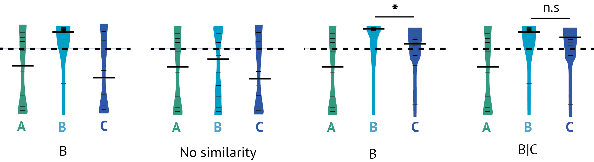
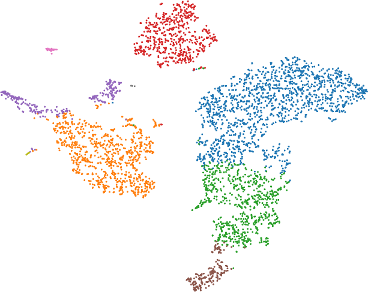

```{r setup, include = FALSE}
knitr::opts_chunk$set(
  collapse = TRUE,
  comment = "#>"
)
library(celaref)
library(knitr) #kable
```
<!--
can't use gitbiook
  bookdown::gitbook:
--> 
<!--
load("/mnt/ceph/mbp/servers/bioinformatics-platform/home/sarah.williams/projects/cell_groupings/analysis/10_data_for_doco/larger_doco_examples.rdata")
-->


# Overview {#overview}


Single cell RNA sequencing (scRNAseq) has made it possible to examine the 
cellular heterogeny within a tissue or sample, and observe changes and 
characteristics in specific cell types. To do this, we need to group the cells
into clusters and figure out what they are.

In a typical scRNAseq experiment the 
gene expression levels are first quantified to per-cell counts (a relatively 
well-established process). Then, cells are clustered into related groups 
(or clusters) on the basis of transcriptional similarity. There are many 
different cell-clustering tools that can do this [@Freytag2017]. 

Clustering tools generally define groups of similar cells - but do not 
offer explanation as to their biological contents. The annotation of the 
'cell type' of each cluster is performed by a domain expert biologist - who 
can examine the known marker genes, or differential expression to understand 
what each cluster might describe. This can be a time-consuming semi-manual 
process, and must be performed before addressing the actual biological 
question of interest. 


The celaref package aims to streamline this cell-type identification step, by 
suggesting cluster labels on the basis of similarity to an already-characterised
reference dataset - wheather that's from a similar experiment performed 
previously in the same lab, or from a public dataset from a similar sample. 


Celaref requires a table of read counts per cell per gene, and a list of the cells 
belonging to each of the clusters, (for both test and reference data). 
It compares the reference sample rankings of the most distinctly enriched genes 
in each query group to match cell types.


## Workflow {#workflow}


A typical celaref workflow is below, characterisising a query dataset’s cell clusters on the basis of transcriptomic similarity to a annotated reference dataset.


### Prepare dataset

The input required is a counts matrix of number of reads per gene per cell, and the cluster assignment for each cell. Cell clusters might be defined by any cell-clustering technique, such as those implemented in tools such as Seurat [@Satija2015], cellRanger (10X genomics), SC3[@Kiselev2017], among many others.

### Within dataset differential expression

Every dataset, whether a query or a reference, is prepared the same way. For every cluster, cells within that cluster are compared to the rest of the cells pooled together, calculating differential gene expression using MAST [@Finak2015]. Because of the low counts and potential dropout issues in single cell RNAseq data, only genes enriched in each cluster are considered. For every cluster – cells are ranked from most to least enriched according to their lower 95% CI of fold-change (for a reasonably robust estimate of fold-change[@topconfect]). Each gene is assigned a ‘rescaled rank’ from 0 (most enriched) to 1. 

Note that this step is the most time consuming, but only needs to be done once per dataset.

### Query-Ref comparison

A list of ‘Up’ genes are extracted for each query cluster – defined as those that have significantly higher expression in that cluster versus the rest of the sample (p<0.01 after BH multiple hypothesis correction). The ‘Up’ gene list is capped at the top 100 (ranked by lower 95% FC).   Then, those genes are looked up in the ranking of genes in each reference cell cluster.  The distribution of these ‘up gene’ ranks is plotted to evaluate similarity of the query cell-group to a reference cell-group. 

### Interpreting output {#interpreting-output}

Typically, every cell cluster in the query data (each box) is plotted against everything in the reference data (X-axis). Each of the ‘up’ genes is represented by a tick mark, and a the median of ranks is shown as a thick bar. A bias near the top indicates similarity of the groups – essentially the same genes are representative of the clusters within their respective samples. The dotted line at 0.25 is an arbitrary threshold of similarity (the top quartile of genes). Note that 0.5 indicates a completely random distribution, but lower values are common due to the reciprocal nature of the within-dataset differential expression. 


### Assigning labels to clusters {#assigning-labels-to-clusters}

Lastly, this package suggests some semi-sensible query cluster labels based on the most similar reference cluster names.

A rough indication of similarity is when the median gene rank (thick bar) is less than (plotted above) the arbitrary threshold of similarity at 0.25 (dotted line). 

However, multiple reference groups will meet that threshold for one query group. This is common when there are similar cell sub-populations in the reference data.

In these cases (see example), some further logic is applied to decide which reference groups should be in the group label :

(a)	If only one reference group is above the threshold, use that group name.
(b)	If nothing meets the threshold, report a lack of similarity.
(c)	If two (or more) reference groups are above the threshold, run a Kolmogorov–Smirnov test on the rescaled rank distributions. If they are significantly (p <= 0.01) different (which might occur for similar but distinct cell types), report only the first. 
(d)	Or if they are not, report both. If there are more than two groups above the threshold, keep testing the first to the second, second to third e.t.c, until a significant difference is found, or there are no more above-threshold groups, reporting everything seen up to that point.





# Using the package

## Quickstart

Suppose there's a new single-cell RNAseq dataset (query), and the cells have 
been clustered into 4 groups : Groups 1-4. But we don't know what they are. 
Luckily, there's an older dataset (ref) of the same tissue type in which 
someone has already determined the cell types (Helpfully named 'dunno', 
'Exciting', 'Mystery cell type' and 'Weird subtype').

Use the reference dataset to figure out what type of cells are in each cluster 
of the new experiment


```{r toy_example, message=FALSE, eval=TRUE, cache=TRUE}

library(celaref)

# Paths to data files.
counts_filepath.query    <- system.file("extdata", "sim_query_counts.tab",    package = "celaref")
cell_info_filepath.query <- system.file("extdata", "sim_query_cell_info.tab", package = "celaref")
counts_filepath.ref      <- system.file("extdata", "sim_ref_counts.tab",      package = "celaref")
cell_info_filepath.ref   <- system.file("extdata", "sim_ref_cell_info.tab",   package = "celaref")

# Load data
toy_ref_se   <- load_se_from_files(counts_file=counts_filepath.ref, cell_info_file=cell_info_filepath.ref)
toy_query_se <- load_se_from_files(counts_file=counts_filepath.query, cell_info_file=cell_info_filepath.query)

# Filter data
toy_ref_se     <- trim_small_groups_and_low_expression_genes(toy_ref_se)
toy_query_se   <- trim_small_groups_and_low_expression_genes(toy_query_se)

# Setup within-experiment differential expression
de_table.toy_ref   <- contrast_each_group_to_the_rest(toy_ref_se,    dataset_name="ref")
de_table.toy_query <- contrast_each_group_to_the_rest(toy_query_se,  dataset_name="query")

# Cross-experimet comparison
de_table.marked.query_vs_ref <- get_the_up_genes_for_all_possible_groups(
   de_table.test=de_table.toy_query ,
   de_table.ref=de_table.toy_ref ,
   test_dataset_name='query')

# Plot
make_ranking_violin_plot(de_table.marked.query_vs_ref)

# And get group labels
make_ref_similarity_names_for_groups_ks(de_table.marked.query_vs_ref, the_test_dataset='query', the_ref_dataset = "ref")
```


The above commands use a toy dataset within the package, and can be copy-pasted 
and run. It is a tiny simulated dataset of 100 genes that will complete very quickly.


## Prepare data {#Input}

The celaref package works with datasets in 'SummarizedExperiment' objects. 
While they can be constructed 'by hand' there are several functions (below) to 
create them in a format with all the required information.

The following peices of information are needed to use a single cell RNAseq 
dataset with celaref.

1. **Counts Matrix** Number of gene tags per gene per cell.
2. **Cell information** A sample-sheet table of cell-level information. Only two 
   fields are essential:
    * *cell_sample*: A unique cell identifier 
    * _group_: The cluster/group to which the cell has been assigned. 
3. **Gene information** Optional. A table of extra gene-level information.
    * *ID*: A unique gene identifier 

The cell information tables can contain whatever experimentally relevant data 
is desired, like treatment, batches, individual ...

The celaref package doesn't do any clustering itself - cells should have 
already been assigned to cluster groups on the basis of transcriptional 
similarity using one of the many single-cell clustering tools available (For a evaluation of some clustering tools: [@Freytag2017]). Note 
that any cells not assigned to a group will not be processed.

For a querying dataset clusters will of course have arbitrary names like 
c1,c2,c3.., but for reference datasets they should be something meaningful
(e.g. 'macrophages'). 

Providing gene-level information is entirely optional, because it can be taken 
from the counts matrix. It is useful for tracking multiple IDs, e.g. [Converting-IDs] 


### Input data 

#### From tables or flat files

The simplest way to load data is with two files. 

A tab-delimited counts matrix formatted as follows:

gene  | Cell1 | cell2 | cell3 | cell4 |  ...  | cell954
------|-------|-------|-------|-------|-------|--------|
GeneA |     0 |     1 |     0 |    1  |  ...  |    0
GeneB |     0 |     3 |     0 |    2  |  ...  |    2
GeneC |     1 |    40 |     1 |    0  |  ...  |    0

And a tab-delimited cell info / sample-sheet file of cell-level information, including the 
group assignment foreach cell ('Cluster'), and any other useful information.

CellId  | Sample  |  Cluster
--------|---------|---------
cell1   | Control | cluster1 
cell2   | Control | cluster7
 ...    | ...     | ...
cell954 | KO      | cluster8

Internally, (and throughout this doco), there are references to the 
'cell_sample' and 'group' columns. They can be named as such in the input cell 
info table, or just assumed or specified when loaded.

The following commands are equivalent, because the first column of the cell 
info table is assumed to be the cell identifier if not specified.

```{r eval=FALSE}

dataset_se <- load_se_from_files(counts_matrix   = "counts_matrix_file.tab", 
                                  cell_info_file = "cell_info_file.tab", 
                                  group_col_name  = "Cluster")

dataset_se <- load_se_from_files(counts_matrix   = "counts_matrix_file.tab", 
                                  cell_info_file = "cell_info_file.tab",
                                  group_col_name  = "Cluster",
                                  cell_col_name   = "CellId" )
```

If there was a table of extra information on the genes:

Gene   | NiceName
-------|-----------       
GeneA  | NiceNameA
GeneB  | NiceNameB
GeneC  | NiceNameC

```{r eval=FALSE}
dataset_se <- load_se_from_files(counts_matrix   = "counts_matrix_file.tab", 
                                  cell_info_file = "cell_info_file.tab", 
                                  gene_info_file = "gene_info_file.tab",
                                  group_col_name = "Cluster")

```

If extra gene information is included, the first column (or a column named ID) 
must be unique. Every gene must match between the counts matrix and gene info.

In contrast, if cell information is missing (from cell info or from the counts),
the cell will just be dropped from the analysis. 
This is useful when excluding cells or subsetting the analysis - it is enough to
remove entries from the cell info table.
If this happens, a warning message will display the number of cells kept.


If the data is already loaded into R, the *load_se_from_tables* funtion
will accept data frames instead of filenames.

```{r eval=FALSE}
dataset_se <- load_se_from_tables(counts_matrix   = "counts_matrix_file.tab", 
                                  cell_info_table = "cell_info_file.tab", 
                                  group_col_name  = "Cluster")
```


#### From 10X pipeline output


The 10X cellRanger pipelines produce a directory of output including the counts 
matrix files and several different clusters. This kind of output directory 
will contain sub-directories called 'analysis', 'filtered_gene_bc_matrices'

To read in a human (GRCh38) dataset using the 'kmeans_7_clusters' clustering:

```{r eval=FALSE}
dataset_se <- load_dataset_10Xdata('~/path/to/data/10X_mydata', 
                                   dataset_genome = "GRCh38", 
                                   clustering_set = "kmeans_7_clusters") 

```

Note that the cell ranger pipelines seem to produce many different cluster sets, 
their names should be seen in the cell loupe broswer, or listed in 
the 10X_mydata/analysis/clustering directory.


NB: This function assumed the file at 10X_mydata/filtered_gene_bc_matrices/GRCh38/genes.csv
will have columns <ensemblID><GeneSymbol>. See function doco if not the case.


#### Special case: Directly with SummarizedExperiment objects

The data loding functions here are just convenient ways of making the SummarizedExperiment 
objects with the content that celaref functions expect, handling naming and 
checking uniqueness e.t.c. 
See [SummarizedExperiment doco](https://bioconductor.org/packages/release/bioc/html/SummarizedExperiment.html)

The minimum mandatory feilds are described in [Input], specifically:

* Within colData(dataset_se): **cell_sample** and **group** columns.
* Within rowData(dataset_se): **ID** column.

Note that **group** needs to be a factor, but **cell_sample** and **ID** 
should _not_ be factors.

The colData (cell information) and rowData (gene information) should exactly 
match the columns and rows of the counts matrix. 

The counts matrix should be integer counts, and a matrix (sparse matrix not 
currently supported). 


#### Reading microarray data {#reading-microarray-data}

Microarray datasets of purified celltypes can be used as references too. 
However, the analysis doesn't use summarisedExperiment objects the same way, so 
it does the within-experiment differential expression directly.

Refer to (#prepare-data-with-within-experiment-differential-expression) for details.

[Limma](http://bioconductor.org/packages/release/bioc/html/limma.html) needs to 
be installed to use this function. Limma is used to calculate the differential 
expression on the microarrays, rather than MAST which is used for the single-cell
RNAseq data.

```{r eval=FALSE}
de_table.microarray <- contrast_each_group_to_the_rest_for_norm_ma_with_limma(
    norm_expression_table=demo_microarray_expr, 
    sample_sheet_table=demo_microarray_sample_sheet,
    dataset_name="DemoSimMicroarrayRef", 
    sample_name="cell_sample", group_name="group") 

```


### Input filtering and Pre-processing

#### Filtering low-expression genes, cells

It is standard practice to remove uninformative low-expression genes before
calculating differential expression. And in single-cell sequencing, low counts 
can indicate a problem cell - which can be dropped. 
Similarly, for the celaref package, very small cell groups will not have the 
statistical power to detect similarity.

The *trim_small_groups_and_low_expression_genes* function will remove cells and 
genes that dont meet such thresholds. Defaults are fairly inclusive, and may 
require tweaking according to different experiments or technologies.

It can be helpful to check the number of genes and cells surviving 
*trim_small_groups_and_low_expression_genes* filtering with *dim(dataset_se)*, 
and the number of cells per group with *table(dataset_se$group)*.

```{r eval=FALSE}
# Default filtering
dataset_se <- trim_small_groups_and_low_expression_genes(dataset_se)

# Also defaults, but specified
dataset_se <- trim_small_groups_and_low_expression_genes(dataset_se, 
                                    min_lib_size = 1000, 
                                    min_group_membership = 5,  
                                    min_detected_by_min_samples = 5)

```
Refer to function doco for exact meaning of these parameters.


#### Converting IDs {#converting-ids}

Converting one type of gene identfier to another gene identifier is annoying. 
Even with major identifers like ensembl IDs (ENSG00000139618) or gene symbols
(SYN1) there will be imperfect matching (missing ids, multiple matches).

If multiple gene IDs were provided when creating the summarizedExperiment 
object, (ie a gene info table/file), a convenience function 
*convert_se_gene_ids* will allow a graceful conversion between them. 

The function needs a tie-breaker for many-to-one gene relationships - picking
the one with higher read counts is a decent choice. Note that if both match, 
the choice is essentially arbitrary (and not neccesarily consistant).

The following code will convert from the original gene IDs (e.g.if ID is 
ensemblID), to 'GeneSymbol' 
(which should be a column name in rowData(dataset_se))

 * Remove any genes that have no GeneGymbol associated with the ensembl ID
 * If the same GeneSymbol is assigned to multiple ensembl IDs - it looks up the 
   *eval_col* value (here specified as 'total_count') and picks the bigger one.

```{r eval=FALSE} 
# Count and store total reads/gene.
rowData(dataset_se)$total_count <- rowSums(assay(dataset_se))
# rowData(dataset_se) must already list column 'GeneSymbol'
dataset_se <- convert_se_gene_ids(dataset_se, new_id='GeneSymbol', eval_col = 'total_count')

```

It can be helpful to check the number of genes before and after 
*convert_se_gene_ids* with *dim(dataset_se)*. 


### Within-experiment differential expression {#prepare-data-with-within-experiment-differential-expression}

Once data is loaded into summarizedExperiment objects, the groups in each 
dataset need to be analysed within-dataset before any cross-dataset comparisons 
can be done.

Essentially, we want to rank all genes from most to least 'distinctive' for each dataset. 

So, using MAST [@Finak2015], differential expression is calculated for every group 
versus the rest of the dataset pooled together. This will provide relative 
expression for everything relative to the rest of the tissue or sample as 
background (which is likely to be similar in other experiments). 
But because single cell RNA seq data can have many zeros and drop outs, celaref 
focusses on overrepresented genes. So genes are ranked from most to least
overrepresented on the basis of their most conservative ('inner') 95% confidence 
interval of log2FC. This rank is a simple compromise between expected size-of-effect 
(log2FC - which can change over-dramatically for low-expression genes), and 
statistical power (from a p-value ranking), discussed in [@topconfect]. 


This is done with the _contrast_each_group_to_the_rest_ function:

```{r eval=TRUE, cache=TRUE}
de_table.demo_query <- contrast_each_group_to_the_rest(demo_query_se, "a_demo_query",      num_cores = 4)
```

And note that any reference datasets are prepared with the same command:
```{r eval=TRUE, cache=TRUE}
de_table.demo_ref   <- contrast_each_group_to_the_rest(demo_ref_se,   "a_demo_reference",  num_cores = 4)
```

For clarity, the results objects have names starting with de_table, but they are simply
tibble (data.frame-like) objects that look like this:
```{r eval=TRUE, echo=TRUE}
head(de_table.demo_query)
```


This object can be now passed to subsequent comparison functions - see [Compare groups to reference](#Making-comparisons-to-reference-data). 


As for what it contains, the important feilds are:

 * __ID__       : Gene ID
 * __fdr__      : The multiple hypothesis corrected p-value
 * __log2FC__   : Log2 fold-change of for this gene's expression in the (test group) - (rest of sample)
 * __ci_inner__ : The inner (most conservative/nearest 0) 95% confidence interval of __log2FC__. This is used to rank genes from most-to-least overrepresnted in this group in the context of the sample tissue.
 * __group__    : Group being tested (all are tested by default)
 * __sig_up__   : Is this gene significantly (__fdr__ <=0.01) enriched (__log2FC__ > 0) in this group.
 * __rank__     : Numerical rank of __ci_inner__ from most (1) to least (n).
 * __rescaled_rank__ : Rank rescaled from most (0) to least (1) - used in analyses and plotting.
 * __dataset__  : Name of this dataset

 


This function is parallelised. Due to the differential expression calculations, this is a 
time-consuming step (e.g. a few hours, depending on data size). 
But the result can and should be saved and reused for any comparisons to other datasets. 
If *num_cores* is specified, up to that many groups will be processed in 
parallel. This is highly recommended, and defaults to a modest 4. For best 
results *num_cores* should be set to the number of groups in the query so long
as system resources permit.


Microarray reference data is treated differently, with function _contrast_each_group_to_the_rest_for_norm_ma_with_limma()_ that both loads data
and does within sample differential expression in one step. Its output is much the same. See 
[section on microarray input](#reading-microarray-data) for details.
```{r eval=TRUE, cache=TRUE}
de_table.microarray <- contrast_each_group_to_the_rest_for_norm_ma_with_limma(
    norm_expression_table=demo_microarray_expr, 
    sample_sheet_table=demo_microarray_sample_sheet,
    dataset_name="DemoSimMicroarrayRef", 
    sample_name="cell_sample", group_name="group") 

head(de_table.microarray)

```


## Running comparisions {#Making-comparisons-to-reference-data}

### Compare groups to reference

Once the dataset has been compared to itself (see [Prepare data with within-experiment differential expression](#prepare-data-with-within-experiment-differential-expression)), its
groups can be compared to the reference dataset.


The main output of celaref are the violin plots of the reference group rankings of query group 
'top' genes. Each query group gets its own panel, with a violin plot of 
its 'top' gene rankings in each reference group. 
See section [Interpreting output](#interpreting-output) and the [overview diagram](#overview) for full information on intepreting these plots. 


To make that output, run function *make_ranking_violin_plot* on the output 
of *de_table.marked.query_vs_ref*:

```{r eval=FALSE, cache=TRUE}

de_table.marked.query_vs_ref <- get_the_up_genes_for_all_possible_groups(
   de_table.test=de_table.demo_query ,
   de_table.ref=de_table.demo_ref ,
   test_dataset_name='query')

# Plot
make_ranking_violin_plot(de_table.marked.query_vs_ref)
```

The *get_the_up_genes_for_all_possible_groups* function will do two things

1. Identify 'top' genes for each group in the query dataset. I.e what is most 
distinctively high for this cell-type/group in the context of this 
tissue/sample. This is defined 
as up to the __first 100 genes with an inner log2FC 95% confidence interval >=1__. 
2. Lookup the rescaled rankings (again from most to least log2FC inner 95% CI) 
of 'top' genes in each reference group. 


With a low number of 'top' genes, usually due to small or heterogenous cell 
group, results will be unreliable. Results are still reported though - its 
quite easy to see these cases with few tick marks on the violin plots and judge
any similarity by eye.

NB: This is why the comparison is directional. Because the 'top' genes in
the reference will be different to those in the query. 


### Compare groups within a single dataset

Its often useful to compare a dataset to itself. Just specify the same dataset 
for *de_table.test* and *de_table.ref*. This will show how similar the groups are.
Clusters that can't be distinguished from each other might be a sign that too
many clusters were defined. 

In this example - there are too few 'top' genes in Group2 to distinguish it from 
Group3, but in the reciprocal contrast the 'top' Genes for group3 do separate 
the two groups. So the groups are reasonable. 

```{r eval=TRUE, cache=TRUE} 

de_table.marked.query_vs_self <- get_the_up_genes_for_all_possible_groups(
   de_table.test=de_table.demo_query ,
   de_table.ref=de_table.demo_query ,
   test_dataset_name='query')

# Plot
make_ranking_violin_plot(de_table.marked.query_vs_self)
```


### Make labels for groups

Lastly, celaref can parse these comparions and suggest group names for the 
query groups. The method used is described in 
[Assigning labels to clusters](#assigning-labels-to-clusters). These names might
make a good starting point for downstream characterisation.

```{r eval=FALSE, cache=TRUE} 
# And get group labels
make_ref_similarity_names_for_groups_ks(de_table.marked.query_vs_ref, the_test_dataset='query', the_ref_dataset = "a_demo_reference")
```

# Example Analyses


## PBMCs - 10X vs Microarray Reference

PBMCs from blood are an easily accessable heterogenous cell sample with several 
similar yet distinct cell types.

10X genomics has severaldatasets available to download from their 
website, including the [pbmc4k dataset](https://support.10xgenomics.com/single-cell-gene-expression/datasets/2.1.0/pbmc4k), 
which contains PBMCs derived from a healthy individual. This example data is the
output of 10X's [cell-ranger](https://support.10xgenomics.com/single-cell-gene-expression/software/pipelines/latest/what-is-cell-ranger) pipeline, which includes
the output of several different unsupervised cell-clustering analyses. 

So there are two questions for the pmbc4k dataset we'd like to address by
comparing it against a reference of known PBMC cell-types:

* What cell-types are in each cluster?
* Which of the clustering analysis is most appropriate?

A suitable reference (a 'HaemAtlas') has been published by @Watkins2009. They
purified populations of PBMC cell types and measured gene expression via 
microarray. The data used here was downloaded in a normalised table from the 
'haemosphere' website [@DeGraaf2016].

***


Going to work with two versions of the kmeans clustering produced by the cell 
ranger pipeline - with k=7 and k=9. For reference, here is how they look when 
colour-coded on a t-SNE plot in the cell-loupe viewer 
(should the brown group be separate to green?):

**kmeans 7**
 

**kmeans 9**



First, load in both datasets and filter the input for genes with low expression,
and too-small groups.

```{r eval=TRUE, echo=FALSE, message=FALSE, warning=FALSE}
# Silently load processed data into memory.
load("/mnt/ceph/mbp/servers/bioinformatics-platform/home/sarah.williams/projects/cell_groupings/analysis/10_data_for_doco/larger_doco_examples.rdata")
```

```{r eval=FALSE}
library(celaref)
datasets_dir <- "~/celaref_extra_vignette_data/datasets"

dataset_se.10X_pbmc4k_k7 <- load_dataset_10Xdata(dataset_path  = file.path(datasets_dir,'10X_pbmc4k'), 
                                                 dataset_genome = "GRCh38", 
                                                 clustering_set = "kmeans_7_clusters", 
                                                 id_to_use      = "GeneSymbol")
dataset_se.10X_pbmc4k_k7 <- load_dataset_10Xdata( dataset_path  = file.path(datasets_dir,'10X_pbmc4k'), 
                                                 dataset_genome = "GRCh38", 
                                                 clustering_set = "kmeans_9_clusters", 
                                                 id_to_use      = "GeneSymbol")

dataset_se.10X_pbmc4k_k7 <- trim_small_groups_and_low_expression_genes(dataset_se.10X_pbmc4k_k7)
dataset_se.10X_pbmc4k_k9 <- trim_small_groups_and_low_expression_genes(dataset_se.10X_pbmc4k_k9)
```

Then prepare the datasts with the within-experiment comparsions. 
Setting the num-cores to the number of groups so they can all run together.
```{r eval=FALSE}
de_table.10X_pbmc4k_k7   <- contrast_each_group_to_the_rest(dataset_se.10X_pbmc4k_k7, dataset_name="10X_pbmc4k_k7", num_cores=7) 
de_table.10X_pbmc4k_k9   <- contrast_each_group_to_the_rest(dataset_se.10X_pbmc4k_k9, dataset_name="10X_pbmc4k_k9", num_cores=9) 
```


```{r eval=FALSE, cache=TRUE}
this_dataset_dir     <- file.path(datasets_dir,     'haemosphere_datasets','watkins')
norm_expression_file <- file.path(this_dataset_dir, "watkins_expression.txt")
samples_file         <- file.path(this_dataset_dir, "watkins_samples.txt")

norm_expression_table.full <- read.table(norm_expression_file, sep="\t", header=TRUE, quote="", comment.char="", row.names=1, check.names=FALSE)

samples_table              <- read_tsv(samples_file, col_types = cols())
samples_table$description  <- make.names( samples_table$description) # Avoid group or extra_factor names starting with numbers, for microarrays

samples_table
```

From the sample table, can see that this dataset includes other tissues, but 
as a PBMC reference, we only want to consider the peripheral blood samples.

```{r eval=FALSE }
samples_table        <- samples_table[samples_table$tissue == "Peripheral Blood",] 
```

```{r echo=FALSE}
kable(head(samples_table))
```


As usually seems to be the case, the hardest part is formatting the input. 
Microarray expression values should be provided as _normalised, log-transformed 
data_ using the _same IDs as the query datset_. Any probe or sample level filtering
should also be performed beforehand. In this case, the data was 
normalised when aquired from the haemosphere website - but still need to match the IDs.

This data is from Illumina HumanWG-6 v2 Expression BeadChips, and gives expression at the probe level.
To be a reference to the single cell PBMC data, it needs to have use same IDs,
gene symbols in this case. Note that it doesn't matter if IDs are only present 
in one or the other dataset - just that the rest match. 

NB: Converting between IDs is easier for single cell datasets using the 
*convert_se_gene_ids* function. But that function expects a SummarizedExperiment 
object, which isn't used for microarray data. 
So it has to be done manually.


```{r eval=FALSE }    
library("tidyverse")
library("illuminaHumanv2.db")
probes_with_gene_symbol_and_with_data <- intersect(keys(illuminaHumanv2SYMBOL),rownames(norm_expression_table.full))

# Get mappings - non NA
probe_to_symbol <- select(illuminaHumanv2.db, keys=rownames(norm_expression_table.full), columns=c("SYMBOL"), keytype="PROBEID")
probe_to_symbol <- unique(probe_to_symbol[! is.na(probe_to_symbol$SYMBOL),])
# no multimapping probes
genes_per_probe <- table(probe_to_symbol$PROBEID) # How many genes a probe is annotated against?
multimap_probes <- names(genes_per_probe)[genes_per_probe  > 1]
probe_to_symbol <- probe_to_symbol[!probe_to_symbol$PROBEID %in% multimap_probes, ]


convert_expression_table_ids<- function(expression_table, the_probes_table, old_id_name, new_id_name){
    
    the_probes_table <- the_probes_table[,c(old_id_name, new_id_name)]
    colnames(the_probes_table) <- c("old_id", "new_id")
    
    # Before DE, just pick the top expresed probe to represent the gene
    # Not perfect, but this is a ranking-based analysis.
    # hybridisation issues aside, would expect higher epressed probes to be more relevant to Single cell data anyway.
    probe_expression_levels <- rowSums(expression_table)
    the_probes_table$avgexpr <- probe_expression_levels[as.character(the_probes_table$old_id)]
    
    the_genes_table <-  the_probes_table %>% 
        group_by(new_id) %>%
        top_n(1, avgexpr)
    
    expression_table <- expression_table[the_genes_table$old_id,]
    rownames(expression_table) <- the_genes_table$new_id
    
    return(expression_table)
}

# Just the most highly expressed probe foreach gene.
norm_expression_table.genes <- convert_expression_table_ids(norm_expression_table.full, 
                                                            probe_to_symbol, old_id_name="PROBEID", new_id_name="SYMBOL")
```


Now read the data and run the within-experiment contrast with 
*contrast_each_group_to_the_rest_for_norm_ma_with_limma*.

Because there is information on which individual each sample is from in the 
'description' feild, this is specified with **extra_factor_name**, and is 
included as a factor in the linear model for limma. This is optional.

```{r, eval=FALSE}    
# Go...
de_table.Watkins2009PBMCs <- contrast_each_group_to_the_rest_for_norm_ma_with_limma(
                 norm_expression_table = norm_expression_table.genes, 
                 sample_sheet_table    = samples_table, 
                 dataset_name          = "Watkins2009PBMCs", 
                 extra_factor_name     = 'description', 
                 sample_name           = "sampleId",
                 group_name            = 'celltype')

```


Compare both the 7 cluster and 9 cluster sets to the purified PBMCs:
```{r eval=TRUE}
de_table.pbmc4k_k7_vs_Watkins2009PBMCs <- get_the_up_genes_for_all_possible_groups(
    de_table.test=de_table.10X_pbmc4k_k7 , 
    de_table.ref=de_table.Watkins2009PBMCs, 
    test_dataset_name='pbmc4k_k7')

de_table.pbmc4k_k9_vs_Watkins2009PBMCs <- get_the_up_genes_for_all_possible_groups(
    de_table.test=de_table.10X_pbmc4k_k9 , 
    de_table.ref=de_table.Watkins2009PBMCs, 
    test_dataset_name='pbmc4k_k9')
```


How does the 7-cluster set look?
```{r, eval=TRUE}
make_ranking_violin_plot(de_table.pbmc4k_k7_vs_Watkins2009PBMCs)
```

Hmmm, there's a few clusters where different the top genes are bunched near the 
top for a couple of different reference cell types. Obviously quite similar. 
Logging the plot will be more informative at the top end.

```{r, eval=TRUE}
make_ranking_violin_plot(de_table.pbmc4k_k7_vs_Watkins2009PBMCs, log10trans = TRUE)
```

The median rank threshold (dotted line) is still at 0.25, but the different 
degrees of match are more obvious. 

What are the group labels?

```{r eval=TRUE}
label_table.pbmc4k_k7_vs_Watkins2009PBMCs <- make_ref_similarity_names_for_groups_ks(de_table.pbmc4k_k7_vs_Watkins2009PBMCs, 
                                        the_test_dataset = "pbmc4k_k7", 
                                        the_ref_dataset  = "Watkins2009PBMCs")

kable(label_table.pbmc4k_k7_vs_Watkins2009PBMCs)
```


How does that compare to the 9 cluster set?
```{r, eval=TRUE}
make_ranking_violin_plot(de_table.pbmc4k_k9_vs_Watkins2009PBMCs, log10trans = TRUE)

label_table.pbmc4k_k9_vs_Watkins2009PBMCs <- make_ref_similarity_names_for_groups_ks(de_table.pbmc4k_k9_vs_Watkins2009PBMCs, 
                                        the_test_dataset = "pbmc4k_k9", 
                                        the_ref_dataset  = "Watkins2009PBMCs")

kable(label_table.pbmc4k_k9_vs_Watkins2009PBMCs)
```


<COMMENTS ON RESUTLS.>


## Mouse neuronal tissue cell-types

In their paper _Cell types in the mouse cortex and hippocampus revealed by 
single-cell RNA-seq_  @Zeisel2015 performed single cell RNA sequencing in 
mouse, in two tissues (sscortex and ca1hippocampus). 

These cell types are have already been described - so this is not how this
method would usually be used. However, this data is included as an example to 
visualise how single cell datasets of similar and different tissue types look,
with respect to a 'known truth'.

First, load the data:
```{r eval=TRUE, cache=TRUE }
library(celaref)
datasets_dir <- "~/celaref_extra_vignette_data/datasets"
zeisel_cell_info_file <- file.path(datasets_dir, "zeisel2015", "zeisel2015_mouse_scs_detail.tab")
zeisel_counts_file    <- file.path(datasets_dir, "zeisel2015", "zeisel2015_mouse_scs_counts.tab")
```


Note the sample data in *zeisel2015_mouse_scs_detail.tab* has the following
information. They specify cell type groups at two different levels, and for 
this example, just going to use *level1class*. Also need to say that *cell_id* 
is, unsurprisingly, the cell identifier.

tissue|total mRNA mol|well|sex|age|diameter|cell_id|level1class|level2class
------|--------------|----|---|---|--------|-------|-----------|-----------
sscortex|21580|11|1|21|0|1772071015_C02|interneurons|Int10
sscortex|21748|95|-1|20|9.56|1772071017_G12|interneurons|Int10
ca1hippocampus|20389|66|-1|23|10.9|1772067060_B09|interneurons|Int9
ca1hippocampus|22515|52|1|31|0|1772067082_D07|interneurons|Int2

```{r eval=TRUE, cache=TRUE }
dataset_se.zeisel <- load_se_from_files(zeisel_counts_file, zeisel_cell_info_file,
                                 group_col_name = "level1class", 
                                 cell_col_name  = "cell_id" )
```


That dataset_se object contains all the data, so subset it into two
objects by tissue (its a SummarizedExperiment object). 
Then separately filter both for low-expression genes and groups with too few 
cells to analyse.

```{r eval=TRUE, cache=TRUE }
# Make two subsets of the sample sheet for the tissues
dataset_se.cortex <- dataset_se.zeisel[,dataset_se.zeisel$tissue == "sscortex"]
dataset_se.hippo  <- dataset_se.zeisel[,dataset_se.zeisel$tissue == "ca1hippocampus"]

# Remove too-small groups, unwanted cells
dataset_se.cortex  <- trim_small_groups_and_low_expression_genes(dataset_se.cortex )
dataset_se.hippo   <- trim_small_groups_and_low_expression_genes(dataset_se.hippo )
```


Next, need to prepare the within-dataset comparisons. 
There are 6 groups in each sample, so assign 6 cores to run them all at once. 
This may take a couple of hours to finish, so be sure to save the result for reuse.

```{r eval=FALSE}
de_table.zeisel.cortex <- contrast_each_group_to_the_rest(dataset_se.cortex, dataset_name="zeisel_sscortex",       num_cores=6) 
de_table.zeisel.hippo  <- contrast_each_group_to_the_rest(dataset_se.hippo,  dataset_name="zeisel_ca1hippocampus", num_cores=6) 
```


Now compare the two: 

```{r eval=FALSE }
# Cross-experimet comparison
de_table.marked.cortex_vs_hippo <- get_the_up_genes_for_all_possible_groups(
   de_table.test=de_table.zeisel.cortex  ,
   de_table.ref=de_table.zeisel.hippo ,
   test_dataset_name='zeisel_sscortex')

# Plot
make_ranking_violin_plot(de_table.marked.cortex_vs_hippo)
```

Perhaps unsurprisingly given they're from the same experiment, the cell-type
annotations do almost perfectly correlate one-to-one.


***


What does a contrast of dissimilar tissues look like? @Farmer2017 have 
recently published a survey of cell types in the mouse lacrimal gland 
(*Defining epithelial cell dynamics and lineage relationships in the developing 
lacrimal gland*) - which should have very different cellular composition.


They have sequenced at the E16 and P4 development stages, we will use
the more developed P4 sample.

```{r eval=FALSE}
library(Matrix) 


Farmer2017lacrimal_dir  <- file.path(datasets_dir, "Farmer2017_lacrimal", "GSM2671416_P4")

Farmer2017lacrimal_matrix_file   <- file.path(Farmer2017lacrimal_dir, "GSM2671416_P4_matrix.mtx")
Farmer2017lacrimal_barcodes_file <- file.path(Farmer2017lacrimal_dir, "GSM2671416_P4_barcodes.tsv")
Farmer2017lacrimal_genes_file    <- file.path(Farmer2017lacrimal_dir, "GSM2671416_P4_genes.tsv")

Farmer2017lacrimal_cells2groups_file  <- file.path(datasets_dir, "Farmer2017_lacrimal", "Farmer2017_supps", paste0(timepoint,"_cellinfo.tab"))
Farmer2017lacrimal_clusterinfo_file   <- file.path(datasets_dir, "Farmer2017_lacrimal", "Farmer2017_supps", paste0("Farmer2017_clusterinfo_",timepoint,".tab"))


 genes <- read.table(genes_file, sep="", stringsAsFactors = FALSE)[,1]
    cells <- read.table(cells_file, sep="", stringsAsFactors = FALSE)[,1]
    counts_matrix <- readMM(matrix_file) #Hmm, some non integers?
    rownames(counts_matrix) <- genes
    colnames(counts_matrix) <- cells
    
    # I'd like to use sparse matrix, but think MAST does not like? Propagates through as an S4 obj after log.
    # Unsure, force as bog std int matrix.
    counts_matrix <- as.matrix(counts_matrix)
    storage.mode(counts_matrix) <- "integer"

#--------------
# counts matrix
counts_matrix.Farmer2017lacrimal <- read_cells_genes_and_matrix_to_count_matrix(matrix_file = Farmer2017lacrimal_matrix_file, 
                                                                                cells_file  = Farmer2017lacrimal_barcodes_file, 
                                                                                genes_file  = Farmer2017lacrimal_genes_file)

#-------------
# Gene info
gene_info_table.Farmer2017lacrimal <- as.data.frame(read.table(Farmer2017lacrimal_genes_file, sep="", stringsAsFactors = FALSE), stringsAsFactors = FALSE)
colnames(gene_info_table.Farmer2017lacrimal) <- c("ensemblID","GeneSymbol") # ensemblID is first, will become ID

#----------------
# Cell/sample info

# Cells to cluster number (just a number)
Farmer2017lacrimal_cells2groups_table <- read_tsv(Farmer2017lacrimal_cells2groups_file, col_types=cols())
# Cluster info - number to classification
Farmer2017lacrimal_clusterinfo_table <- read_tsv(Farmer2017lacrimal_clusterinfo_file, col_types=cols())  
# Add in cluster info
Farmer2017lacrimal_cells2groups_table <- merge(x=Farmer2017lacrimal_cells2groups_table, y=Farmer2017lacrimal_clusterinfo_table, by.x="cluster", by.y="ClusterNum")

# Cell sample2group
cell_sample_2_group.Farmer2017lacrimal <- Farmer2017lacrimal_cells2groups_table[,c("Cell identity","ClusterID", "nGene", "nUMI")]
colnames(cell_sample_2_group.Farmer2017lacrimal) <- c("cell_sample", "group", "nGene", "nUMI")
# Add -1 onto each of the names, that seems to be in the counts
cell_sample_2_group.Farmer2017lacrimal$cell_sample <- paste0(cell_sample_2_group.Farmer2017lacrimal$cell_sample, "-1")


#----------------
# Create a summarised experiment objct.
dataset_se  <- load_se_from_tables(counts_matrix.Farmer2017lacrimal, 
                                   cell_info_table = cell_sample_2_group.Farmer2017lacrimal,
                                   gene_info_table = gene_info_table.Farmer2017lacrimal )


# Use gene symbols for ids (this does remove some genes)
rowData(dataset_se)$total_count <- rowSums(assay(dataset_se))
dataset_se  <-  convert_se_gene_ids( dataset_se,  new_id='GeneSymbol', eval_col='total_count')

# Useful filtering  - remove too-small groups, unwanted cells
dataset_se <- trim_small_groups_and_low_expression_genes(dataset_se)

return(dataset_se)


```


# References


